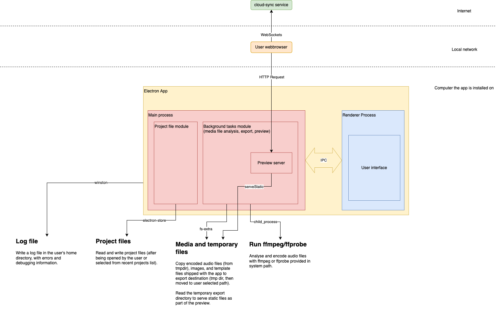

# Audio Orchestrator

_Audio Orchestrator_ is a desktop application for prototyping orchestrated audio experiences.

Create a project, import audio files, and author metadata for audio objects, sequence destinations, and user controls to define the experience; then start a preview with real devices on your local network or export a web application bundle to host it on a server.

 * [**Download** the latest release](https://github.com/bbc/audio-orchestrator/releases).
 * [**Read** the user guide](https://bbc.github.io/audio-orchestrator).
 * [**Build** on the template application and client libraries](https://github.com/bbc/audio-orchestration).

_Audio Orchestrator_ requires `ffmpeg` and `ffprobe` to be available in the system path or a specific location in your home directory. For a manual installation, place the binaries in `~/audio-orchestrator-ffmpeg/bin` on macOS and `%HOME%\audio-orchestrator-ffmpeg\bin` on Windows. See the [installation instructions](https://bbc.github.io/audio-orchestrator/installation/) for more details.

**NB** _Audio Orchestrator_ by default uses a synchronisation service currently hosted by the BBC, which may go away without warning in the future. We recommend replacing this with your own server. There are [some notes on running a self-hosted cloud-sync server](https://github.com/bbc/audio-orchestration/issues/64).

# Architecture overview

_Audio Orchestrator_ is an [_Electron_](https://www.electronjs.org/) app, using a _React_ app built with _webpack_ for the user interface (in the "renderer" process), and managing background tasks to facilitate file access, media analysis and encoding, and the preview server (in the "main" process).



# Development

Development requires a macOS (or possibly Linux) environment. The instructions have only been tested on macOS (on an Apple Silicon machine with macOS Sequoia). The build however produces installers for both Windows (x86) and macOS (x86 and arm64).

## Getting started

1. Ensure you have [Node.js](https://nodejs.org/en/) version 20.x+ installed.

```
node -v # e.g., v20.9.0
```

2. Log in to the GitHub packages NPM registry. Create a [personal access token (classic)](https://github.com/settings/tokens) with only the `read:packages` permission, then log in using your GitHub username and the token as the password:

```
npm login --registry https://npm.pkg.github.com --scope @bbc
```

**Install the dependencies:**

```
npm install
```

This will install packages from npm to `node_modules/` and then download the required binaries for Electron.

**Start a development version of the app:**

```
npm run dev
```

During development runs, a local server is started on port 8080 to host the `react-frontend`; make sure this port is not used for anything else or the Electron window will show something else or just a white screen. Changes to the frontend source code should be reflected immediately. The app needs to be restarted for changes to the background tasks or electron app to take effect.

**Build the installers for distribution:**

```
npm run dist
```

The outputs are written to the `./dist/` folder.

## Repository structure

All dependencies and scripts are listed in the single `package.json` at the top level of this repository. The relevant folders are:

  * `react-frontend/`: The user interface, written with _React_ and _Redux_, interacting with electron APIs through globals set in a preload script.
  * `background-tasks/`: Tasks interacting with subprocesses and the file system, used by the `electron-app` to provide system operations that can be called from the `react-frontend`.
  * `electron-app/`: The `electron-app`, bundling and configuring all the other components to create a standalone desktop application.
  * `logging/`: A common logging module used by the `background-tasks` and `electron-app` components.

## Releases and versions

Pull requests should update the main `package.json` version and run `npm install && npm run credits` before they are merged to ensure the new version is used throughout. Changelog.md should also be manually updated.

Currently, releases are locally built (`npm run dist`) and manually uploaded to GitHub (macOS, macOS-arm64, Windows).

## History

_Audio Orchestrator_ was originally developed in the [BBC R&D](https://www.bbc.co.uk/rd/) Audio Team by Kristian Hentschel with contributions from Jon Francombe, Emma Young, Danial Haddadi, and Sonal Tandon between 2019 and 2022. It was distributed through the BBC _Connected Studio MakerBox_ site, and used in several public pilots on [BBC Taster](https://www.bbc.co.uk/taster/). The software is now available to interested members of the community through this Audio Orchestrator open source repository, but will not see significant further development from the BBC.