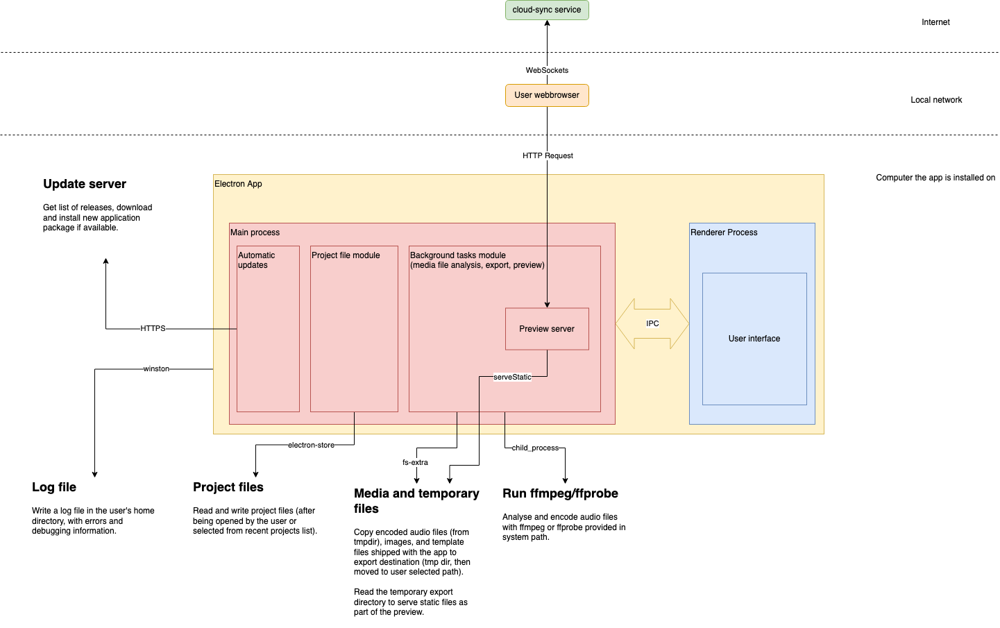

# Audio Orchestrator

_Audio Orchestrator_ is a desktop application for prototyping orchestrated audio experiences.

Create a project, import audio files, and author metadata for audio objects, sequence destinations, and user controls to define the experience; then start a preview with real devices on your local network or export a web application bundle to host it on a server.

The software is currently distributed to BBC staff and external users (subject to a licence agreement) via [BBC Connected Studio MakerBox](https://www.bbc.co.uk/makerbox).

 * Preview an [example project](https://orchestrator-demos.virt.ch.bbc.co.uk/getting-started-with-orchestration) made with it.
 * [Read the user guide](https://bbc.github.io/bbcat-orchestration-docs).
 * [Request access to use _Audio Orchestrator_](https://www.bbc.co.uk/makerbox/tools/audio-orchestrator).
 * [Join the community](https://makerbox-discourse.tools.bbc.co.uk/c/immersive/audio-orchestrator).
 * See also these related repositories:
    * the [template](https://github.com/bbc/bbcat-orchestration-template/) application used for the preview and export,
    * the [library](https://github.com/bbc/bbcat-orchestration/) for handling audio rendering and communication between devices in the template, and
    * the [docs](https://github.com/bbc/bbcat-orchestration-docs/).

_Audio Orchestrator_ requires `ffmpeg` and `ffprobe` to be available in the system path. Both are most easily installed with [homebrew](https://brew.sh) by running `brew install ffmpeg`. If installing them manually ensure the binaries are placed in `~/audio-orchestrator-ffmpeg/bin`, and see the [installation instructions](https://bbc.github.io/bbcat-orchestration-docs/installation/) for more details.

# Architecture overview

_Audio Orchestrator_ is implemented in the [Electron](https://www.electronjs.org/) framework, using [React](https://reactjs.org/) for the front-end, and providing a background task service that accesses the file systems and spawns media analysis and encoding child processes. Communication between Electron's two processes (main and renderer) is done via IPC channels.



_NB the update service shown in the diagram is not yet implemented._

# Development

## Getting started

You'll need:

  * [Node.js](https://nodejs.org/en/) (version 12+ recommended)
  * [yarn](https://classic.yarnpkg.com/lang/en/) (notes may be for 1.x)

Configure yarn to use your developer certificate and install packages from the R&D Artifactory service instead of npm ([more details on confluence](https://confluence.dev.bbc.co.uk/display/audioteam/bbcat-orchestration+libraries+and+tools)):

```
export CERTIFICATE_FILENAME=/path/to/your/cert
yarn config set cert -- "$(openssl pkcs12 -in $CERTIFICATE_FILENAME -nodes -clcerts -nokeys | LC_ALL=C sed '/^Bag Attributes:/d; /^subject=.*CN=BBC FMT Greenhouse - Root/,$d')"
yarn config set key -- "$(openssl pkcs12 -in $CERTIFICATE_FILENAME -nodes -nocerts)"
yarn config set registry https://artifactory.virt.ch.bbc.co.uk/artifactory/api/npm/npm 
```

Install the dependencies:

```
yarn install # runs yarn install in each package directory
```

Run a development version of the app:

```
yarn dev
```

Build the `.dmg` installer:

```
yarn dist
```

Building the installer may require a valid Apple development certificate in your keychain. When it is built, the installer can be found in `electron-app/dist/mac`.

## Repository structure

The packages are designed to be used together to build the Electron app. The current structure looks like this:

  * `react-frontend/`: The user interface, written with _React_ and _Redux_, interacting with electron APIs through globals set in a preload script.
  * `background-tasks/`: Tasks interacting with subprocesses and the file system, used by the `electron-app` to provide a REST API to the `react-frontend`.
  * `electron-app/`: The `electron-app` bundling and configuring all the other components to create a standalone desktop application.
  * `logging/`: A common logging module for server-side packages based on `winston`.

Running `yarn install` at the top level installs dependencies for all of these packages. References between them are expressed using the link syntax (e.g. `link:../logging`) in `package.json` files. We do not use any special monorepo management scripts such as _lerna_ or _yarn workspaces_.

The development version (`yarn dev`) builds the `background-tasks`, `electron-app`, and `logging` packages; and runs a development server for the `react-frontend`. Changes to the frontend source code are automatically reflected after a few seconds, but you may need to reload the page (CMD-R in the electron app). Changes to the other packages require the `yarn dev` command to be run again (CTRL-C in the terminal session to stop it). _NB the frontend development server runs on port 8080; make sure this is not used by something else._

## Releases and versions

The [Changelog](./Changelog.md) and [GitHub Releases]() are updated manually, usually on minor version increments (e.g. `0.17.0` to `0.18.0`). We create a Github release linked to a git tag for that version.

To create a release build and the `.dmg` installer run the `yarn dist` task. As the tool is currently distributed through MakerBox, upload the dmg to Dropbox and notify the team in the `#makerbox-orchestrator` channel.

The versions of all packages in this repo should be kept in sync by running the `yarn bump` script at the top level to apply the same version change across all packages. Generally, we increment the patch version for every PR, and increment the minor version for new releases (NB this is not strictly compatible with semantic versioning).

## Team

_Audio Orchestrator_ is developed in the BBC R&D Audio Team ([confluence](https://confluence.dev.bbc.co.uk/display/audioteam/)), as part of the _Audio Device Orchestration_ workstream contributing to the _Novel Audience Experiences_ programme.

Email [Kristian.Hentschel@bbc.co.uk](mailto:kristian.hentschel@bbc.co.uk) or [Jon.Francombe@bbc.co.uk](mailto:jon.francombe@bbc.co.uk) or find us on Slack (`#audio-orchestration` in the BBC R&D space).
