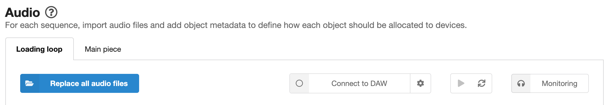

# Audio page

On the audio page, you can import audio files (prepared according to the [guidelines](preparing-audio.md)) and set up [behaviours](#behaviours) that define how each object should be allocated to devices. There are also some shortcuts to features from the [Monitoring page](monitoring.md).

Each sequence has its own set of audio files and behaviours. Switch between sequences by clicking the tabs (which are labelled with your sequence names).

## Adding and replacing audio files

To **add an initial set of audio files**, just click the "Add audio files" button. Find the files you want to add, select them, then press "Open". You'll see the audio files appear as rows in a table, with various options which are explained below.

You can **delete** single or multiple files by selecting the checkboxes for the files you'd like to delete, then pressing the delete button at the top right of the table.

You can also **replace** the full set of audio files by clicking "Replace all audio files".

!!! Tip
    When replacing audio files, if you select fewer new files than are already loaded, then any missing files will show errors (*"No audio file matches the object number"*). You'll need to manually delete these objects. It is only possible to import full sets of files.

!!! Error
    If you have any sequences with no audio files, you will not be able to preview or export the experience. There will be an error message on the [Export page](export.md) (*"No audio files have been added"*).

## The audio object table

Once you've imported your files, they'll appear as rows of the audio object table. In each row, you'll see a checkbox, the filename, a [panning](#panning) setting, two [fixed behaviours](fixed-behaviours.md), and an ["Add behaviour" button](#add-behaviour). These are detailed below. Any [behaviours](#behaviours) that you've added will also be shown in the table row.

## Panning

The current panning value for each object is shown in the object table row.

To change the panning, just click the current value, which will reveal a slider. You can either adjust the panning using the slider, or click the "L", "R", or "C" buttons for 100% left, 100% right, or centre panning respectively.

The panning cannot be changed for stereo objects.

!!! Tip
    See the [Preparing audio assets](preparing-audio.md#prepare-panning) page for information on automatic panning based on the filename.

!!! Info
    Panning is implemented by a Web Audio API [StereoPannerNode](https://developer.mozilla.org/en-US/docs/Web/API/StereoPannerNode) for browsers in which this is supported, and by other Web Audio API components that mimic the behaviour where the StereoPannerNode is not supported.

## Behaviours

Behaviours determine how each object should be allocated to devices. This lets you customise the listener experience, ensuring that it is flexible and can adapt to the number of connected devices and to settings that listeners make using [controls](controls.md).

There are four types of behaviour.

* [**Fixed behaviours**](fixed-behaviours.md) are always included for every object. They define the device roles and number of devices that objects can be allocated to. Fixed behaviours are shown as dropdown lists in the audio object table.
* [**Control-linked behaviours**](control-linked-behaviours.md) are linked to any [controls](controls.md) that you've set up.
* [**Custom behaviours**](custom-behaviours.md) give you more flexibility in deciding how the objects should be allocated.
* The [**Image and effects behaviour**](image-behaviour.md) allows you to add timed images and effects, attached to audio objects, to the experience.

The four behaviour types are described in more detail in the linked documentation pages.

### Add behaviour button

The "Add behaviour" button is used to add behaviours to the objects. Clicking the button will reveal a dropdown list containing the behaviour options. Click the option you need to apply it to the object.

* The **control-linked behaviours** (which relate to any [controls](controls.md) that you have set up) appear at the top of the list with orange dots. You can only add one instance of each control-linked behaviour to each object. See [Control-linked behaviours](control-linked-behaviours.md) for more details.

* The **custom behaviours** appear after the control-linked behaviours. There are six custom behaviour types (*Preferred if*, *Allowed if*, *Prohibited if*, *Exclusive*, *Change management*, and *Mute if*), each with a different colour dot. See [Custom behaviours](custom-behaviours.md) for more details.

* The ***Images and effects*** behaviour appears after the custom behaviours. See [*Images and effects* behaviour](image-behaviour.md) for more details.

When you add a behaviour to an object, it will appear as a coloured box in the object's row of the audio object table.

### Editing and deleting behaviours

Behaviours that have editable parameters (all [control-linked behaviours](control-linked-behaviours.md), most [custom behaviours](custom-behaviours.md), and the [image and effects behaviour](image-behaviour.md)) will show an "editable" icon. Clicking on the behaviour will open its settings.

All [control-linked behaviours](control-linked-behaviours.md), [custom behaviours](custom-behaviours.md), and the [image and effects behaviour](image-behaviour.md) have a delete button ("X" icon) on the right hand side (you'll be asked to confirm that you want to delete the behaviour).

### Adding the same behaviour to multiple objects

The same behaviour can be added to multiple objects in one go. Select all of the objects to which you want to add the behaviour (using the checkboxes on the left hand side of the object table), then click the "Add behaviour" button (either above the audio object table, or on any of the selected objects).

## Monitoring

*Audio Orchestrator* has a monitoring system that can be used to see and hear the effect that your behaviours have on your mix. Detailed control of the monitoring system is found on the [Monitoring page](monitoring.md), but there are shortcuts to some of the features on the Audio page.

* The **Connect to DAW** button will connect *Audio Orchestrator* to your digital audio workstation (DAW). The first time this option is used, a settings dialogue box will be shown. The settings can be opened again by clicking the cog icon next to the "Connect to DAW" button. See the [Monitoring page](monitoring.md#daw-connect) documentation for more details on connecting to a DAW.
* The **Play/pause** button will control audio playback when *Audio Orchestrator* is connected to the REAPER DAW.
* The **Rerun allocation algorithm** button causes the [allocation algorithm](allocation-algorithm.md) to be rerun without needing any of the changes that would normally cause that to happen (a device being added or dropping out, or a control value changing). This can be useful for testing different possible random allocations.

!!! Tip
    On the Audio page, you won't be able to see any effect of clicking "Rerun allocation algorithm". You will be able to see changes on the [Monitoring page](monitoring.md) as well as hearing the changes if you've connected to a DAW.

* The **Monitoring** button is a shortcut to opening the Monitoring page.

*Monitoring system shortcuts from the Audio page*
