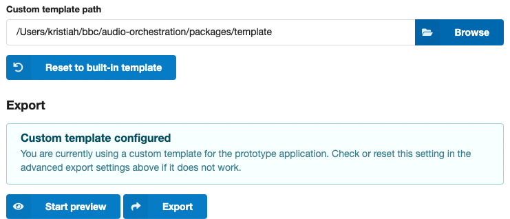

# Using a custom template

The [prototype web application](prototype.md) used in a preview or export of your experience is generated by combining a template included with *Audio Orchestrator* with the audio files, metadata and preferences you authored. If you require additional user interface features or customisation, you can also use your own version of the template, created from our open source repository.

!!! Info
    The source code for the audio orchestration template and supporting libraries is available from the [`@bbc/audio-orchestration` repository](https://github.com/bbc/audio-orchestration) on GitHub under a GPLv3 licence.

## Creating a custom template

Creating a custom template requires some knowledge of JavaScript, HTML, and CSS and a _Node.js_ development environment.

Follow the [instructions in the Readme file](https://github.com/bbc/audio-orchestration#readme) to set up your development environment. In short, you will need to:

1. clone the `@bbc/audio-orchestration` repository;
2. install the dependencies (`npm install`); and
3. build all libraries and the template (`npm run build -ws`).

You can now make changes to the template by editing the files under `packages/template/src`. Remember to rebuild (`npm run build`) the template before using it with *Audio Orchestrator*.

## Using a custom template with *Audio Orchestrator*

To use the custom template in your project, use the [Export page](export.md) to set the location of the directory that includes your build. Then you can preview and export your experience as with the standard template.

!!! Info
    After building the custom template, you should have a new `dist/` directory in `packages/template/dist` which contains the compiled JavaScript, CSS, HTML, and image files making up the prototype application.

On the Export page, under *Advanced settings*, click browse and select the `template` directory containing the `dist/` directory and the `package.json` file.

*Point to the location of your custom template in the Advanced settings on the Export page of your project.*

Once you have selected a template directory, an information block confirming this will be shown above the export and preview buttons.

If you wish to return to using the standard template included with *Audio Orchestrator*, simply click the *Reset to built-in template* button next to the setting.

*You can always switch back to using the built-in template if there are any problems.*

!!! Tip
    *Audio Orchestrator* will always create a copy of your template's `dist/` directory, in which it will replace the contents of the `audio/` directory and the configuration in `index.html`.

    This means that you cannot use *Audio Orchestrator* to update the audio files and configuration in the live preview of the template you would get by running a development server.

    If you wish to make changes to the template code while also having your audio files and sequence configuration available, you will need to manually copy the contents of the `dist/audio` directory and the relevant configuration in the `index.html` file from an *Audio Orchestrator* export to your working copy.

!!! Tip
    If your custom template requires additional configuration options that *Audio Orchestrator* does not know about, you should specify these outside of the `index.html` file, as this will get overwritten on export. The source code contains some suggestions on how to do this in comments in the [`template/src/config.js`](https://github.com/bbc/audio-orchestration/blob/main/packages/template/src/config.js) file.
