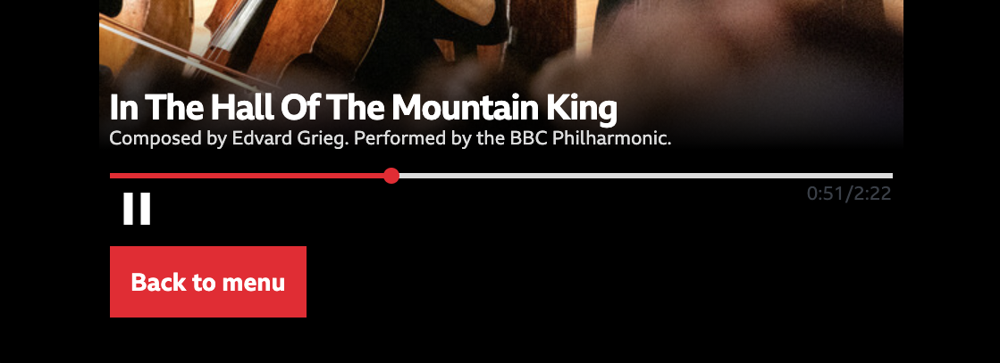
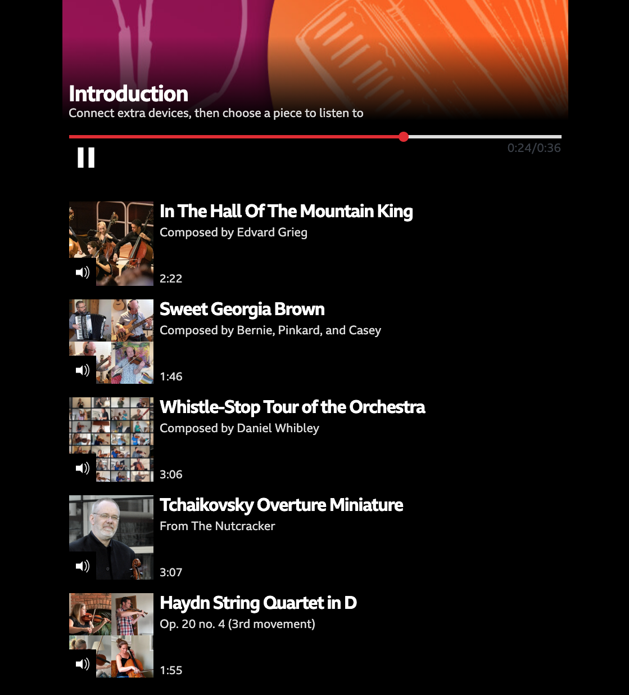
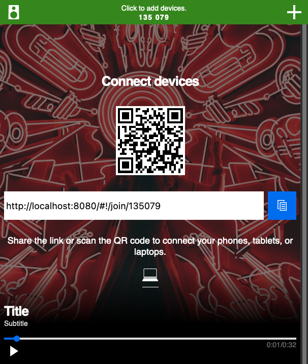

# Customising the prototype application

The output from using *Audio Orchestrator* is a [prototype web application](prototype.md) for the orchestrated audio experience that you've built. This is a combination of HTML pages and JavaScript code that includes all of the necessary components for audio orchestration, wrapped with a user interface.

Many aspects of the prototype application can be customised from the [Appearance page](appearance.md) in *Audio Orchestrator*. However, there are some extra features that you can use by editing the source code.

To do this, you'll need to [export the application](export.md#export-export), make changes to the `index.html` file, and then [host the application](export.md#export-export).

!!! Info
    In addition to modifying `index.html` to enable features already built into the prototype application as described on this page, you can also [create your own custom template](custom-template.md) for more wide-reaching changes.

!!! Warning
    Any manual changes you make to `index.html` will not be reflected in subsequent versions that you might export from *Audio Orchestrator*. You'll either need to make such changes as the final step, or be prepared to copy them over.

## Showing sequence destinations as thumbnail images

Destinations are sequences that can be reached from the current sequence. When the user has a choice of sequence to move to, that choice is shown as a labelled button.


*A labelled destination button in the [Pick A Part](productions.md#pick-a-part) experience*

It is possible to add a thumbnail image, title, subtitle, and duration to the destination buttons. This might be desirable, for example, when the listener can select different pieces of music to listen to (as in the [*Pick A Part*](productions.md#pick-a-part) and [*Seeking New Gods*](productions.md#seeking-new-gods) trial productions).


*Thumbnail-style destination buttons in the [Pick A Part](productions.md#pick-a-part) experience*

Each individual destination can be either a standard button (the default) or a thumbnail-style button. The instructions given below assume that you've already set up the sequence destinations up in *Audio Orchestrator* and just need to change some of them to use the thumbnail styling.

### Set which destination buttons should use the thumbnail styling

In the `index.html` file, sequences and their destinations are set up in the `config` object, which starts `const config = {` and has many properties that each define an aspect of the experience.

Each sequence has an object in an array called `SEQUENCE_URLS`. Each sequence object has a property called `next`. This is an array of objects, each of which defines one destination.

To use the thumbnail style for one of these destinations, you just need to add `thumbnail: true,` as a property of the object for that choice.

```js
next: [
  {
    contentId: CONTENT_ID_MAIN,
    label: 'Main content',
    thumbnail: true,
  },
],
```

!!! Tip
    If the `thumbnail` property is not specified for an object, the default is `thumbnail: false`. Destinations in the export from *Audio Orchestrator* will not include the `thumbnail` property, so you'll need to add it.

### Add the necessary metadata to the sequences

Now the prototype application knows to use the thumbnail styling for one or more destinations, but it also needs to know what images, titles, subtitles, and durations to use. Those elements are specified as properties of the sequence that is the target of the destination (i.e., in the code example given above, the sequence which has `contentId: CONTENT_ID_MAIN`). You'll need to add the following properties.

* `sequenceImage`: A path to an image file for the sequence. This can be a full URL, or a relative path in the distribution. It is recommended that images are placed in the `images/` folder of the exported distribution.
* `sequenceImageAlt`: Alternative text for the sequence image file.

!!! Tip
    Alternative (or alt) text is important for accessible design; among other benefits, it enables those using screen readers to better understand the page.

    Good alt text provides a concise but complete description of the image. See, for example, the [BBC mobile accessibility guidelines](https://www.bbc.co.uk/guidelines/futuremedia/accessibility/mobile/text-equivalents/alternatives-for-non-text-content) for more details.

* `sequenceTitle`: A title for the sequence.
* `sequenceSubtitle`: A subtitle for the sequence.
* `duration`: The duration of the sequence, in seconds. This needs to be entered manually, so you should check that it matches the duration that's shown on the playing page for the same sequence.

```js
SEQUENCE_URLS: [
  {
    contentId: CONTENT_ID_MAIN,
    url: SEQUENCE_URL_MAIN,
    hold: true,
    skippable: false,
    sequenceImage: 'images/main-sequence-image.jpg',
    sequenceImageAlt: 'Description of sequence image',
    sequenceTitle: 'Main sequence title',
    sequenceSubtitle: 'Main sequence subtitle',
    duration: 30.0,
    next: [],
  },
],
```

The `sequenceTitle`, `sequenceSubtitle`, and/or `duration` fields can all be safely omitted—those parts will just not show on the button. If `sequenceImage` is omitted or the specified image cannot be found, then no image will be displayed.

It should be noted that the title, subtitle, and image that you specify will also be used in the main playing page for that sequence. If desired, the image could be overwritten using the [Images and effects behaviour](image-behaviour.md).

## Hidden default destinations

When the experience reaches the end of a sequence, and `Wait for user` flag is not set, the first sequence destination is automatically selected. 

To select a different path when the user does not make an active choice, you can hide a destination.

In `index.html`, add a `hidden: true` flag to the destination you wish to hide. Sequence destinations are specified in the `next` array of the sequence you are planning to move from, in the `SEQUENCE_URLS` array. In the example below, only the "Continue" button leading to `sequence-2` will be visible. If the listener does not interact with it, the application will instead move on to the `sequence-fallback` sequence.

```js
const config = {
  // ...
  SEQUENCE_URLS: [
    {
      contentId: 'sequence-1',
      // ...
      hold: false,
      skippable: true,
      next: [
        {
          contentId: 'sequence-fallback',
          label: 'Fallback',
          hidden: true,
        },
        {
          contentId: 'sequence-2',
          label: 'Continue',
        },
      ]
    },
    // ...
  ],
};
```

## Connection instructions during onboarding sequence

Usually, the connection instructions are shown only when the listener clicks on the _+_ button to add a device. You may instead wish to show joining link and QR code by default during an onboarding sequence. To achieve this, simply add the `instructions: true` flag to the relevant sequence in the `SEQUENCE_URLS` configuration. You may also customise the text (only shown on larger screens) by setting `TEXT_ONBOARDING_TITLE` and `TEXT_ONBOARDING_DESCRIPTION`.

```js
const config = {
  // ...
  TEXT_ONBOARDING_TITLE: 'Connect devices',
  TEXT_ONBOARDING_DESCRIPTION: 'Share the link or scan the QR code to connect your phones, tablets, or laptops.',
  SEQUENCE_URLS: [
    {
      contentId: 'sequence-0',
      instructions: true,
      // ...
    },
    // ...
  ],
}
```


*Onboarding instructions shown directly on the playing page during a specific sequence.*
