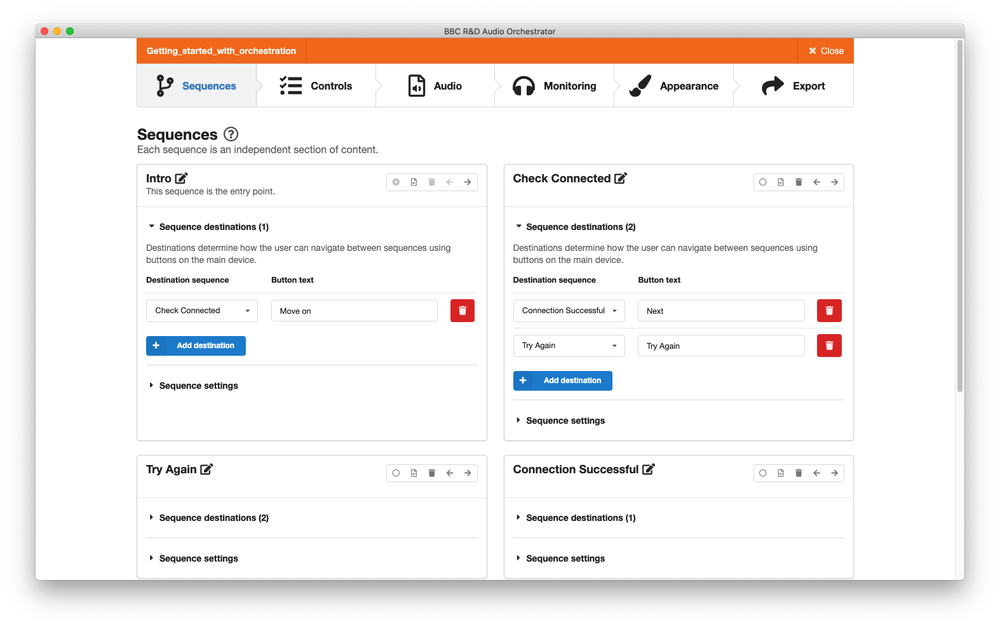
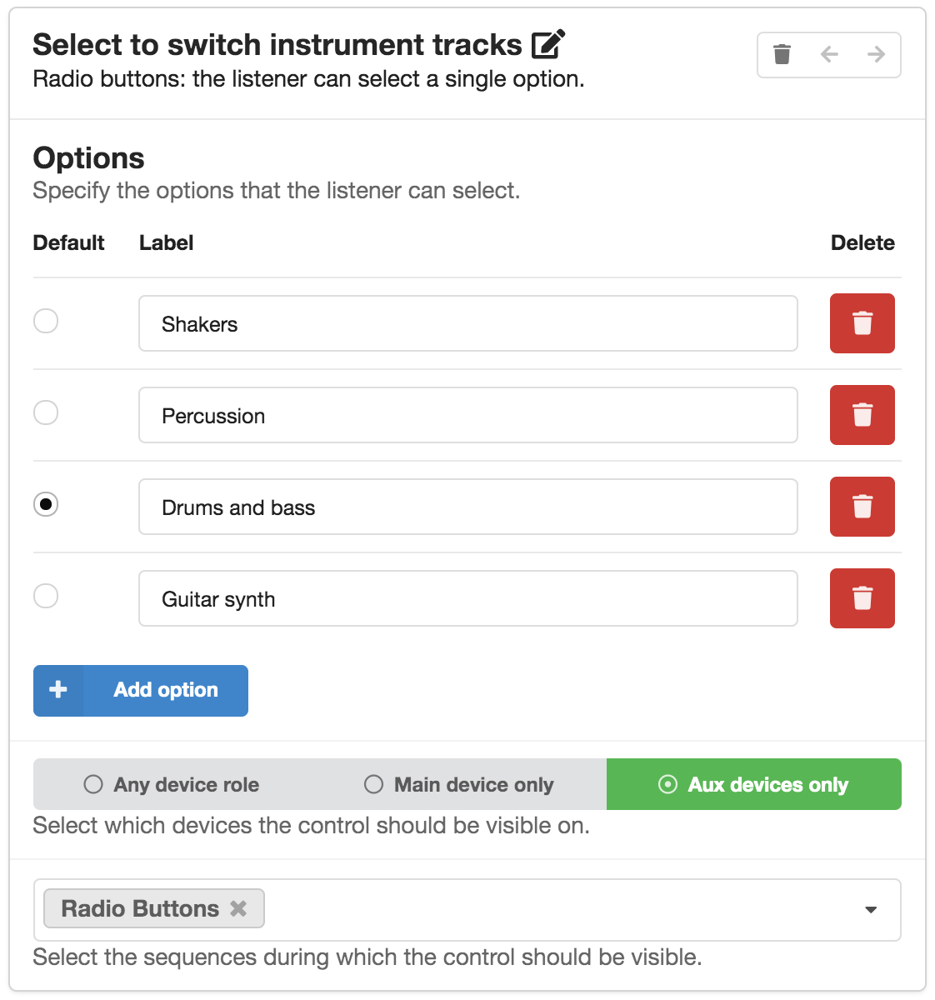
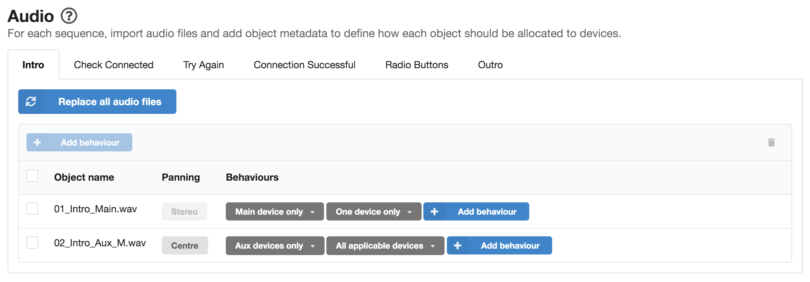
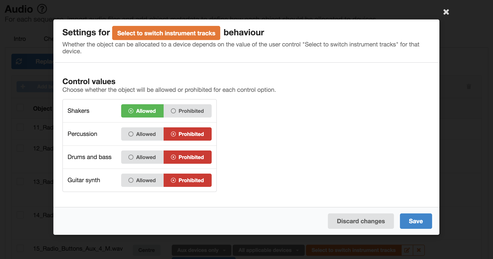
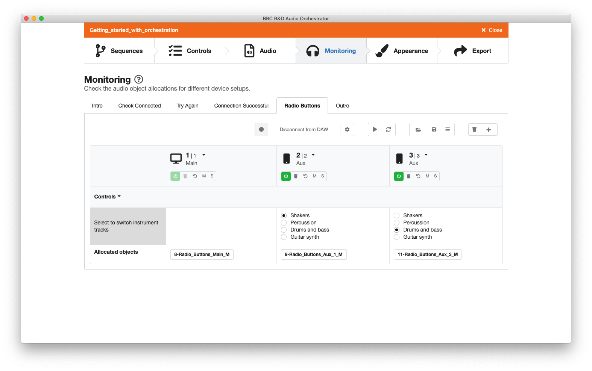
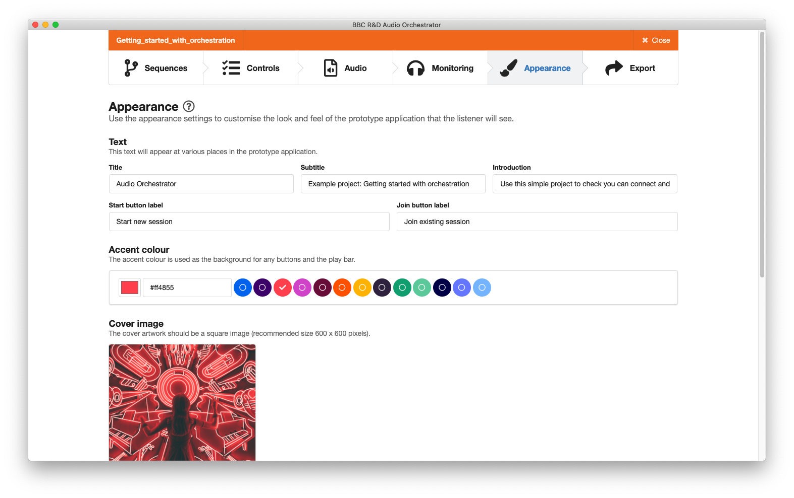
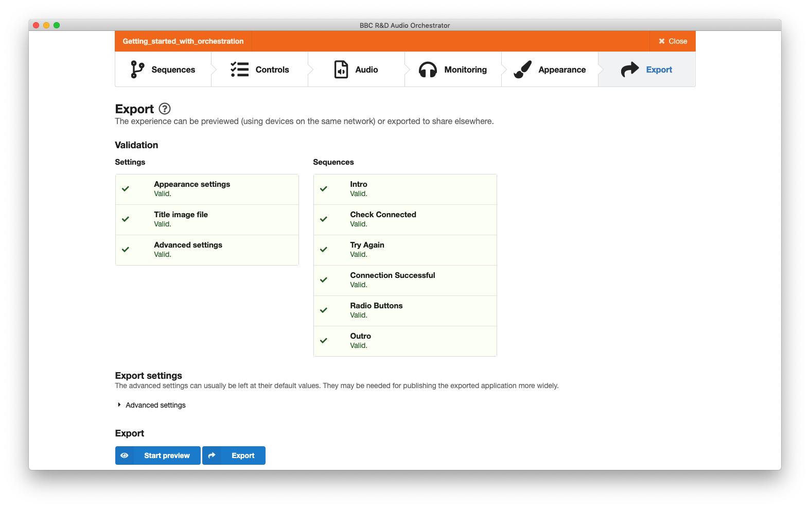

# Example project: "Getting started with orchestration"

We have produced an example *Audio Orchestrator* project called "Getting started with orchestration" that shows off some of the features of the technology and the production tool. You can use this as a starting point for learning about how to use the tool.

## Project overview

This example demonstrates some straightforward behaviours and the use of radio buttons as a [user control](controls.md). If you [preview](export.md#export-preview) the demo in your browser, the audio will guide you through the steps required to connect an aux device and help you check that sound can be heard on the connected device. You’ll also see a set of radio button controls in action and you’ll be able to use them to switch different audio objects on and off.

In the sections below, we'll talk you through the *Audio Orchestrator* project for the "Getting started with orchestration" example.

## Opening the project

Once you've opened *Audio Orchestrator*, click "Open" and navigate to the example project file `Getting_started_with_orchestration.orc`.

## The Sequences page

You’ll land on the [Sequences page](sequences.md) and see that the demo is made up of six sequences. These independent sections of content have either one or two [*sequence destinations*](sequences.md#sequence-destinations) assigned (shown in brackets next to the "Sequence destinations" sections of the sequence cards). Click on the sequence destination dropdowns to view these assignments to get a feel for the user journey through the experience. You’ll see the button text associated with each sequence and the sequence destination assigned to each button.

In the [*sequence settings*](sequences.md#sequence-settings) dropdowns, you’ll see that some sequences are set to loop until the listener makes a choice with the button(s) displayed on the main device throughout, while others are set to display the button(s) only at the end of a sequence, when the audio has finished playing out. In the sequence named "Connection Successful", you’ll see that the settings are set to neither loop nor wait for the listener. In this case the sequence will play a section of content then automatically move on to its destination sequence without any input from the listener.

*The Sequences page*

## The Controls page

If you move to the [Controls page](controls.md), you’ll see there is a radio buttons control named "Select to switch instrument tracks". This text is displayed to the listener along with the options you set up—in this case there are four labelled options, with the default option set to "Drums and bass". Note that this control is set to display on aux devices only, and will only be displayed to the listener while the sequence named "Radio Buttons" is playing out.

{: .ao-image-tall}
*Setting up a control for switching instrument tracks*

## The Audio page

Moving to the [Audio page](audio.md), you’ll see the collection of audio files that have been imported into the project as audio objects for the sequence named "Intro". You’ll also see that there are tabs for each of the sequences that were specified on the Sequences page.

If you click through each tab, you’ll see that each sequence contains a number of audio objects and that each audio object has a panning option and the two fixed behaviours. These fixed behaviours determine:

  * where each audio object is allocated based on device role i.e. whether the audio is sent to the main device, an aux device or to any device; and
  * the number of devices the audio object can be allocated to.

### "Intro" sequence: panning and fixed behaviours

Looking again at the "Intro" sequence, you’ll see that there is a stereo audio file named `01_Intro_Main.wav` and that its [fixed behaviours](fixed-behaviours.md) are set to "Main device only" and "One device only", meaning that it will only ever play from the main device. In contrast, the second object `02_Intro_Aux_M.wav` is a mono audio file with a panning setting you can adjust. In this case, it is panned centrally, and the fixed behaviours are set such that it will only be played from aux devices, but played from all of the aux devices that are connected.

!!! Tip
    The example project was updated with the [v0.18.0 release](change-log.md#v18) of *Audio Orchestrator* to use stereo files rather than split mono files. Older versions of the example project may have mono files panned left and right rather than stereo files.

!!! Tip
    Note the naming convention that has been used when creating these audio files: the suffix "\_M" has been used so that *Audio Orchestrator* can [automatically determine](preparing-audio.md#prepare-panning) that the audio object should be panned centrally. You can also use the suffixes "\_L" and "\_R" to specify whether an audio object should be panned fully left or fully right respectively. You can also set these manually and adjust the degree of left and right panning (click on the panning value to access the adjustment slider). See the [Audio page](audio.md#panning) for more information.

*Panning and fixed behaviour settings in the "Intro" sequence*

### "Radio Buttons" sequence: using control-linked behaviours

If you click on the "Radio Buttons" tab, you’ll see that in addition to the fixed behaviours, [control-linked behaviours](control-linked-behaviours.md) have been authored for four of the audio objects. These behaviours determine whether an audio object plays out or not based on the actions of the listener, and have been applied to the audio files that the listener will be able to switch on and off using the radio buttons control you saw on the Controls page. If you click on one of the orange control-linked behaviours, you’ll see that each object has been set as *Allowed* or *Prohibited* according to its associated control option. For example, the audio file `9_Radio_Buttons_Aux_1.wav` is a shaker instrument track; the control-linked behaviour has been set so that the audio object is *allowed* when the user selects the option "Shakers", and *prohibited* for the other three control options.

*Control linked behaviour applied to an object in the "Radio Buttons" sequence*

## The Monitoring page

On the [Monitoring page](monitoring.md), you'll see a table with some virtual devices. You can use these to check that the behaviours that were set up on the Audio page have the desired effects. Switching to the *Radio Buttons* sequence will enable the "Select to switch instrument tracks" control. You should find that selecting one of the control values results in the appropriate object being shown in the *Allocated objects* row at the bottom of the table.

You can use the "Load device setup" button to switch to a different preset device setup—for example, to check what will happen to the allocations if there are five devices rather than three. And you can create custom device setups with the "Add device" button.

*The Monitoring page showing a setup with three virtual devices. The two aux devices each have a different value set for the "Select to switch instrument tracks" control, and therefore different objects are allocated.*

## The Appearance page

On the [Appearance page](appearance.md) you’ll see the title, subtitle, and introduction text that will be displayed to the user, along with the start and join button labels (in this case we are using the default button labels). You’ll also see the selected accent colour and the cover image that will appear on all devices (again, we're using the default image in this case).

*The Appearance page*

## The Export page

The [Export page](export.md) shows the validation status for all of the settings and sequences—you should see that all of these are green. At the bottom of the page, you’ll see the options to either preview the experience or to export the project.

*The Export page*

Click "Start preview". *Audio Orchestrator* will take a short moment to prepare the project, and will then allow you to open the preview in your Internet browser to see the demo in action.

*Export as preview modal dialogue*

Click "Start new session" to begin, and listen to the instructions to follow along with the demo.

*The previewed "Getting started with orchestration" application. Left: start a new session or join an existing one. Centre: the playing page. Right: connection instructions, also showing how many devices are connected.*
