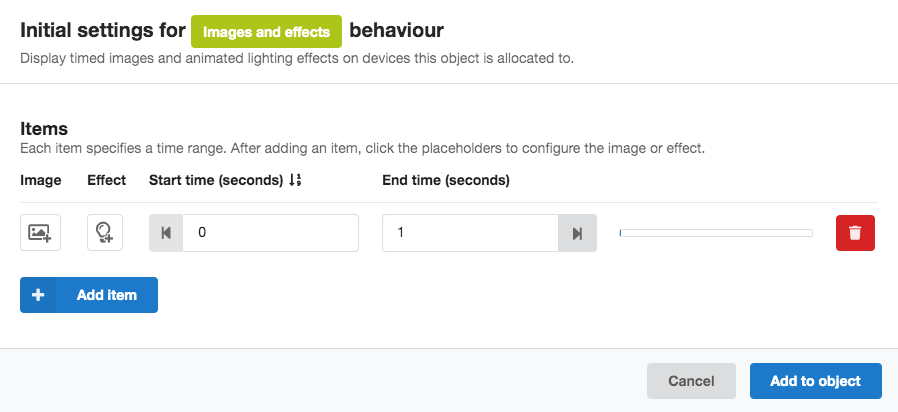
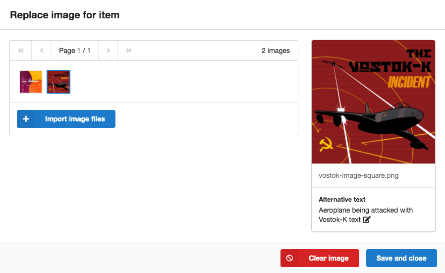
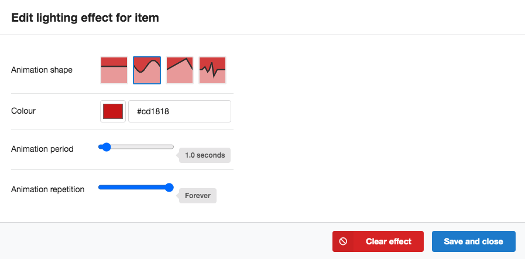

# Images and effects behaviour

The *Images and effects* behaviour allows you to add timed images and effects to your experience. These must be attached to an audio object, and will show on a device when that object is allocated.

!!! Tip
    If you don't want images that are attached to particular objects (therefore inheriting the object allocations), you could create an empty "dummy" object for your images by importing a silent audio file.

The image will show in the cover image section of the [prototype application](prototype.md). The effect will exist on top of any image that you've added, and consist of a solid colour overlay that can be animated in different ways (see [Adding effects](#adding-effects) below).

Images and effects will show while the experience is playing; the [cover image](appearance.md#cover-image) will show while the player is paused. There is a short crossfade between any change in images or effects.

To add an *Images and effects* behaviour, click the "Add behaviour" button in the audio object table and select "Images and effects". The Initial settings dialogue box will appear. You can add a number of "items", each of which can have an [image](#adding-images) and an [effect](#adding-effects). When you add an item, you'll see the following screen.

*Initial settings dialogue for the Images and effects behaviour*

* Use the "add image" and "add effect" buttons to select the [image](#adding-images) and/or [effect](#adding-effects) for your item (as described below).
* You can set the start and end time for the item (in seconds).
    * The maximum end time is equal to the sequence duration
    * Clicking the left-facing arrow by the start time input will snap the start time to the end of the previous item, or to the beginning of the sequence if there is no previous item.
    * Likewise, clicking the right-facing arrow by the end time input will snap the end time to the start of the next item, or to the end of the sequence if there is no subsequent item.
    * You'll see a visual representation of where the images fall on the sequence timeline in the bar on the right hand side of the table.
* You can delete an item by clicking the red delete button.

!!! Tip
    **Overlapping images and effects**

    * If you have multiple items that overlap in time, then the item higher up the list will be shown in the experience.
    * If you have Images and effects behaviours added to multiple audio objects with overlapping times, the images and effects attached to the object nearest the bottom of the [audio object table](audio.md#audio-object-table) will be shown in the experience.

Once you're happy with the settings, click "Add to object". These can be edited later.

## Adding images

To add an image, click the "add image" button (an image icon with a plus symbol) in the Image column of the table. This will open a dialogue box showing a collection of images that have been imported into the project.

*Repository of available images to add to an item*

* To add a new image, click Import image files.
* Select the image that you'd like to add to the item by clicking its thumbnail.
* It will then appear in the larger preview on the right hand side of the dialogue, where you can add alternative text.

    !!! Tip
        Good alt text provides a concise but complete description of the image. See, for example, the [BBC mobile accessibility guidelines](https://www.bbc.co.uk/guidelines/futuremedia/accessibility/mobile/text-equivalents/alternatives-for-non-text-content) for more details.

* Click Save and close to add your selected image to the item.

To change an image or remove an image from an item, click the image thumbnail that's replaced the "add image" button, then either select a different image or press the red Clear image button.

When there is no image to display, the cover image specified on the [Appearance](appearance.md#cover-image) page will be used.

!!! Tip

    Using many large images will place a burden on slow Internet connections, so you may want to consider reducing the file sizes of your images.

    There are various ways of doing this; on macOS, these include using *Preview* or the `convert` utility that comes with the *ImageMagick* suite. (For our [trial experiences](productions.md), we used the command `convert in.png -strip -interlace Plane -quality 90% -resize 600x600 out.jpg`.)

### Image format

The image format required is the same as for the cover image specified on the [Appearance](appearance.md#cover-image) page.

* You should use a square image, ideally 600 x 600 pixels. Images that aren't squares will be cropped to square.
* Images should use the JPEG (`.jpg` or `.jpeg`), PNG (`.png`), or GIF (`.gif`) formats.

## Adding effects

To add an effect, click the "add effect" button (a lightbulb icon with a plus symbol) in the Effects column of the table. This will open a dialogue box showing the available effects and settings.

*Lighting effect settings*

* The **animation shape** defines the pattern of the transparency of the colour effect. There are four options.

    1. **Constant**. The colour will remain constant and not fade. It will cover any image that is attached to the same item.
    2. **Sine**. The colour will fade in and out in a sinusoidal pattern.
    3. **Sawtooth**. The colour will fade in and out in a sawtooth pattern.
    4. **Heartbeat**. The colour will fade in and out in a heartbeat pattern.

* The **colour** sets the colour of the lighting effect.

* The **animation period** is the time taken for one pattern of the **animation shape** to be completed (from 0.5 to 10.0 seconds).

* The **animation repetition** sets the number of times that the **animation shape** pattern will be repeated (from 1 to 10 times, or indefinitely).

Click Save and close to add the effect to the icon.

To change an effect or remove an effect from an item, click the effect thumbnail that's replaced the "add effect" button, then either modify your effect settings or press the red Clear effect button.
