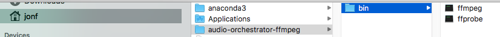

# Installing ffmpeg and ffprobe on macOS manually

To manually install *ffmpeg* and *ffprobe* for use with _Audio Orchestrator_, follow these instructions.

<!-- Or repeat the general steps here, e.g. to do all the download steps at once. -->

!!! Warning
    _Audio Orchestrator_ is an experimental tool from the BBC for creating multi-device audio experiences. Like many other programs, it uses `ffmpeg` and `ffprobe` under the hood. You do _not_ need it just to run `ffmpeg` and `ffprobe`. **Only follow the instructions below if you want to use _Audio Orchestrator_ but a standard `ffmpeg` installation is not possible.** We generally recommend using Homebrew (i.e., `brew install ffmpeg`, which includes `ffprobe`) instead.

!!! Info
    If you still need to install _Audio Orchestrator_ itself, follow the [macOS installation instructions](installation-mac.md) first.

1. **Download *ffmpeg* and *ffprobe*.**
    1. Go to [https://ffmpeg.org/download.html](https://ffmpeg.org/download.html) and click the Apple logo in the "Get packages & executable files" section.
    2. Click "Static builds for macOS 64-bit".
    3. You'll see two options for downloading *ffmpeg*. Choose the one with the shorter filename; this will look like `ffmpeg-<versionNumber>.7z`, where `<versionNumber>` is something like `4.3.1`.
    4. Underneath this heading, click "Download as ZIP".
    5. Scroll down the page until you see ffprobe. Choosing the shorter filename, under `ffprobe-<versionNumber>.7z`, click "Download the file as ZIP".
    6. If a popup appears after clicking the download link, press "allow" or "save".
    7. Open your _Downloads_ folder, and double-click `ffmpeg-<versionNumber>.zip`. This will extract it using the _Archive Utility_ and create an executable `ffmpeg` file in _Downloads_.
    8. Repeat this step for `ffprobe`.
    9. You should now have two executables, called `ffmpeg` and `ffprobe`.

2. **Move the downloaded files to the right location.**
    1. Open your *home folder*.
        * Your *home folder* has the same name as your user account. The easiest way to find it is to open *Finder*, and use the keyboard shortcut `command + shift + H` or in the menu bar select _Go > Home_. 
        * You should see folders such as _Desktop_, _Applications_, and _Downloads_ in this folder.
    2. Create a new folder called `audio-orchestrator-ffmpeg` in your home folder.
        * Go to _File > New folder_ or use the shortcut `command + shift + N`, type or enter the folder name, and press `return` to confirm.
    3. Open your new `audio-orchestrator-ffmpeg` folder by double-clicking it.
    4. Create a new folder called `bin` in `audio-orchestrator-ffmpeg`.
    5. Move the `ffmpeg` and `ffprobe` files from `Downloads` into this `bin` folder.
    6. You should now have two files, `ffmpeg` and `ffprobe`, in your `~/audio-orchestrator-ffmpeg/bin/` folder.

    
*ffmpeg and ffprobe executables with the required folder structure*

3. **Authorise *ffmpeg* and *ffprobe*.**
    1. Double-click the file called `ffmpeg`.
    2. You should see an error message *"ffmpeg can’t be opened because it is from an unidentified developer"*. Click "OK".
    3. Go to _System Preferences > Security and Privacy_ and click on the _General_ tab.
    4. At the bottom of the window you will see a message saying that *ffmpeg* was blocked. Click "Open Anyway".
        * If you do not see this message in the General tab, double-click `ffmpeg` again.
        * You may have to click the "unlock" button and enter your password to be able to click "Open Anyway".
    5. If you see another popup that says *“ffmpeg is from an unidentified developer. Are you sure you want to open it?”*, click "Open". If you don’t get this popup, just go to the same file and double-click it again.
    6. When you double-click the file, a *Terminal* window may open. Keep the terminal open until you see a message confirming you can close it.
    7. Repeat authorisation steps (a) to (f) for the file called `ffprobe`.

