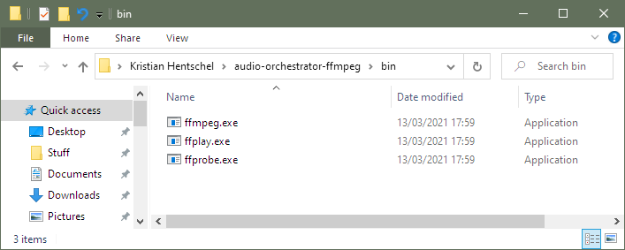

# Installing Audio Orchestrator on Windows

To use _Audio Orchestrator_ on a Windows computer, follow the instructions below.

!!! Info
    *Audio Orchestrator* requires at least Windows 7 and a 64-bit system.

!!! Warning
    Windows support in *Audio Orchestrator* is still experimental. We recommend backing up your project files before moving them between systems.

## Install Audio Orchestrator

1. Run `BBC R&D Audio Orchestrator Setup.exe` and follow the instructions.

2. If you already have *ffmpeg* and *ffprobe* installed, that's it—you're ready to go. If not, read on for instructions on installing these.

You can open *Audio Orchestrator* using the shortcuts in the Start menu and on your Desktop.

## Install ffmpeg and ffprobe

To use *Audio Orchestrator*, you need to have an installation of *ffmpeg* and *ffprobe* version 4.1.0 or later. If you're not sure whether you have these, just try opening *Audio Orchestrator*. You'll see an error message if you don't have the required software installed.

1. **Download the ffmpeg distribution.**
    1. Go to [https://ffmpeg.org/download.html](https://ffmpeg.org/download.html) and click the Windows logo in the "Get packages & executable files" section.
    2. You'll find multiple options for downloading _Windows EXE Files_. On the linked sites, look for a download named `release-essentials-zip` or `ffmpeg-{version}-win64-{version}.zip` and download the .ZIP file.
    3. In the popup, choose _Open with Windows Explorer_.

!!! Info
    It's easy to end up with a `latest` or `master` or `git` development build of ffmpeg, and this won't work with *Audio Orchestrator*. Always look for one that says `release` or includes a two-part version number like `4.1` in the file name.

2. **Move the downloaded files to the right location.**
    1. Open a second Windows Explorer window
    2. In the address bar, enter the path `%userprofile%` and press Enter to open your user's home directory. Alternatively, you can browse to `C:\Users\<your name>` (it's the folder that contains Desktop, Documents, Downloads, etc.). If Windows can't find the `%userprofile%` path, try replacing it with `%HOME%` throughout these instructions.
    3. Create a new folder in your home directory and name it `audio-orchestrator-ffmpeg`
    4. Move the contents of the ffmpeg directory from the downloaded .ZIP file into `audio-orchestrator-ffmpeg` (there may be several files and a folder called `bin`).
    5. You should now have `ffmpeg.exe` and `ffprobe.exe` in the folder `%userprofile%\audio-orchestrator-ffmpeg\bin`. If your ffmpeg download only contained the `.exe` files, you may have to create the `bin\` folder yourself.

*ffmpeg and ffprobe executables with the required folder structure*

!!! Tip
    You can check that *ffmpeg* is installed correctly by opening a command prompt (`Windows + R`, enter `cmd`); and running the command `%userprofile%\audio-orchestrator-ffmpeg\bin\ffmpeg`. This should print the version information, starting with either `ffmpeg version 4.4` or `ffmpeg version n4.4`. Some available builds do not have a version in this format, and are not supported by *Audio Orchestrator*.

    A previous version of *Audio Orchestrator* did not recognise *ffmpeg* versions with the `n` prefix. Please make sure you are using the latest version.

