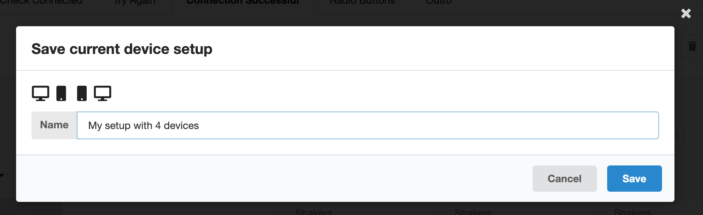
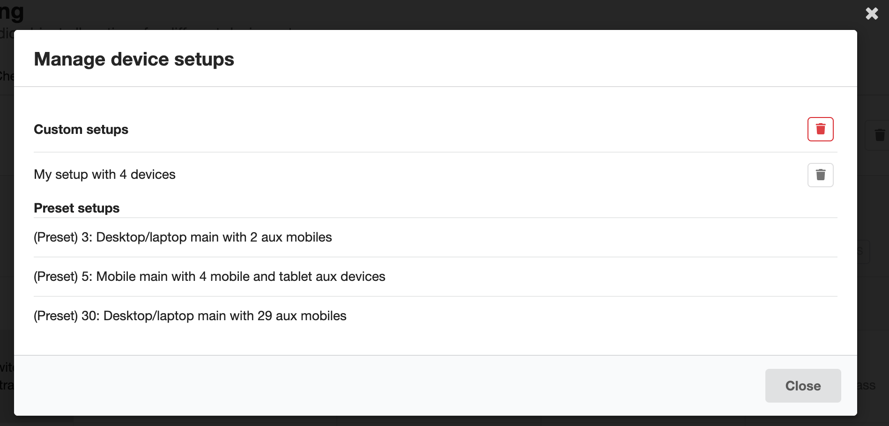
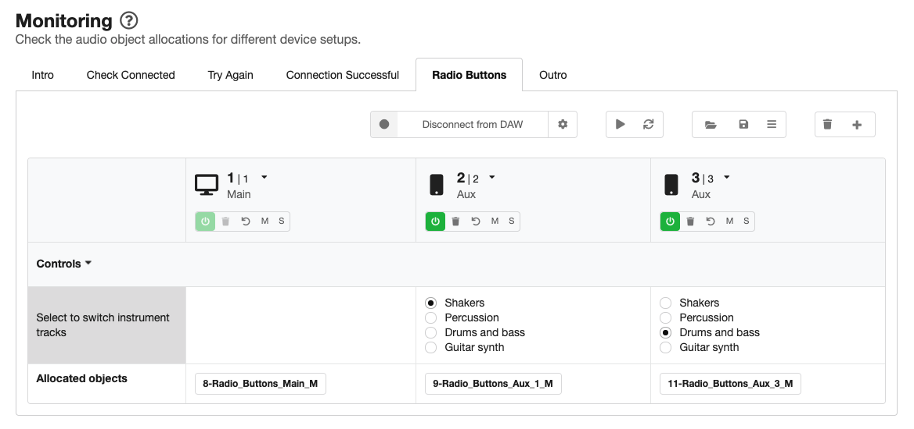
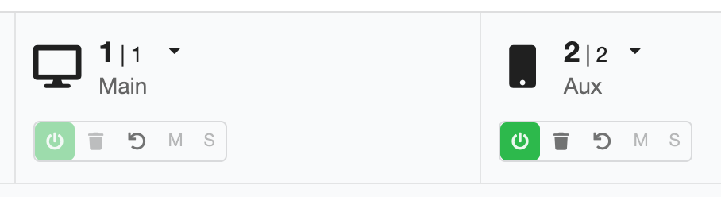

# Monitoring page

When you're designing an experience, it's really useful to be able to check what the audience will see and hear. With *Audio Orchestrator*, you can do this by generating a preview of the experience (on the [Export page](export.md)). But that can be quite a slow process—for example, you'll have to reconnect devices every time you make a change.

Monitoring your experience is particularly necessary for orchestrated productions because in many cases you won't know exactly what the end reproduction system will be, and your experience needs to be able to adapt to different combinations of devices.

The Monitoring page in *Audio Orchestrator* can be used to test out your behaviours by visually inspecting them and/or listening to the effect that they have on a virtual device setup.

* You can add any number of virtual devices with different properties (such as [control values](controls.md) or any [device metadata](custom-behaviours.md#device-metadata) that can be used by behaviours) and see how your objects are allocated.
* You can switch between preset device setups, or create and store your own custom setups.
* You can connect *Audio Orchestrator* to your digital audio workstation (DAW) so that you can control playback and listen to the effect of your behaviours on the mix.

## Monitoring system options

At the top of the Monitoring page, there are tabs to move between the sequences of your experience.

!!! Tip
    When you change sequences in either of the Monitoring or Audio pages, that change will also be reflected on the other page so you can move freely between the two pages.

There are also various buttons that control elements of the monitoring system.

* The **Connect to DAW** button will connect *Audio Orchestrator* to your digital audio workstation (DAW). The first time this option is used, a settings dialogue box will be shown. The settings can be opened again by clicking the cog icon next to the "Connect to DAW" button. See the [Connecting to a digital audio workstation](#daw-connect) documentation for more details on connecting to a DAW.
* The **Play/pause** button will control audio playback when *Audio Orchestrator* is connected to the REAPER DAW.
* The **Rerun allocation algorithm** button causes the [allocation algorithm](allocation-algorithm.md) to be rerun without needing any of the changes that would normally cause that to happen (a device being added or dropping out, or a control value changing). This can be useful for testing different possible random allocations.

The next three buttons are about the virtual device setup.

* The **Load device setup** button brings up a list of existing device setups (either presets or setups that you've added to the project) that you can load. Click on a setup label to load that setup. The current setup (i.e. the collection of devices currently displayed in the table) will be overwritten.

!!! Warning
    When you load a new virtual device setup, the current setup will be overwritten without warning. So make sure you've saved any changes to the current setup that you'd like to keep.

* The **Save this device setup** button saves the current setup (that is, the group of virtual devices shown in the table and any control settings). You'll see icons for the devices in the current setup. Type the name you'd like to use to refer to the setup, then click Save.

*Save current device setup dialogue*

!!! Tip
    Saved device setups are stored in the `.orc` project file, and are only available in the project from which they were saved.

* The **Manage device setups** button opens a dialogue where you can manage the device setups saved into the current project. You'll see a list of any custom setups that you've saved into the project, followed by the three preset setups. You can delete all custom setups (using the red delete button at the top of the list) or individual setups (using the grey delete button next to each setup). You cannot delete preset setups.

*Manage device setups dialogue*

The final two buttons relate to the virtual devices in the current setup.

* The **Delete all devices** button deletes all devices from the current setup (with the exception of the main device, which can't be deleted). You'll be asked to confirm this action.

* The **Add device** button can be used to add a new virtual device into the table. You can choose whether the new device is a desktop/laptop, mobile, or tablet (though this can also be changed in the virtual devices table).

## Virtual devices table

The main element of the *Audio Orchestrator* Monitoring page is a table of *virtual devices*, simulating devices that are connected into your experience. Each device appears as a column of the virtual devices table.

*The virtual devices table with three devices. Different objects are allocated to the two aux devices because of their control values.*

### Device metadata and buttons

In the top row of the table, you can see and modify some information about the [*device metadata*](custom-behaviours.md#metadata) for each device.

* An icon shows the device type (desktop/laptop, mobile, or tablet). Click the icon or dropdown arrow to change the device type.
* There are two numbers shown for each device.
    * The first is the **joining number**. This number specifies the order in which aux devices join the session. The main device has joining number 1.
    * The second is the **current number**. This is the joining number after it is corrected for any devices that have dropped out of the session.
* The is also an indication of device role (main or aux).

The joining number, current number, and device role cannot be changed manually. The first device is always the main device.

Below the device metadata there is a collection of buttons.

  * The **On/off** button switches the device on or off. Switch a device off to temporarily remove it from the setup.
  * The **Delete** button permenantly removes a device from the setup.
  * The **Reset** button resets all controls on the device to their default values.
  * The **Mute** button mutes audio objects that are only allocated to the device (when connected to a DAW).
  * The **Solo** button solos the audio objects that are allocated to the device (when connected to a DAW).

*Device metadata and buttons for a main device and an aux device*

### Control values

Below the device metadata and buttons, the table contains a row for each of the controls (i.e. those that you've set up on the [Controls page](controls.md)). The control name appears in the leftmost column. In the table cells for each virtual device, you can interact with the control just like you could on connected devices in your previewed or exported [prototype application](prototype.md). Interacting with any control will cause the [allocation algorithm](allocation-algorithm.md) to be rerun, therefore reallocating the audio objects.

The control rows can be minimised or maximised by clicking the controls header row (which shows a downward- or sideways-facing arrow).

Controls may not be visible in all sequences of an experience, or on all device roles (i.e. main or aux devices), depending on the settings on the [Controls page](controls.md). When a control is not visible on a device, it still maintains its current value (or the default value if a value has not been set by the listener). In sequences where a control is not visible, it will still be shown in the monitoring system virtual devices table. However, that control will be greyed out and you will be unable to interact with it. Hovering the mouse over the greyed-out control will show the sequences in which that control is enabled.

### Allocated objects

For each device, the final row of the table shows a label for each audio object that is currently allocated. The allocation will update every time a change causes the [allocation algorithm](allocation-algorithm.md) to be rerun (for example, a device being added or dropping out; a control value changing; or a [behaviour](audio.md#behaviours) or [control](controls.md) being added, removed, or edited in Audio Orchestrator).

If any behaviours cause a gain adjustment (for example, the [*Gain adjustment if*](custom-behaviours.md#gain-adjustment) or [*Mute if*](custom-behaviours.md#mute-if) behaviours), this will be shown in the object label. (Gain changes are not currently reflected in the audio monitoring when *Audio Orchestrator* is connected to a DAW.)

## Connecting to a digital audio workstation

*Audio Orchestrator* can connect to your DAW so that you can play and pause the audio playback and listen to the effect that any behaviours you've authored will have on your mix (for the current device setup in the monitoring system).

There are two ways of making the connection: you can connect directly to the REAPER DAW, or you can use a third party plugin. Connection instructions for each version are given below.

!!! Tip
    *Audio Orchestrator* uses [Open Sound Control](http://opensoundcontrol.org/) (OSC) messages to communicate with the DAW. Messages are sent over a [UDP port](https://en.wikipedia.org/wiki/User_Datagram_Protocol).

### Laying out your DAW session

With either connection method, it is very important that there is one track for each of your audio objects, and that the [number at the beginning of the object filename](preparing-audio.md#requirements) matches the track number in your DAW.

Note that when you switch between [sequences](sequences.md) in your *Audio Orchestrator* project, you might need to navigate to a different part of your DAW project (or even open a different session).

!!! Warning
    If you're working in an existing DAW project, it is recommended to backup your original file and/or to work on a copy of the file.

### Connecting directly to REAPER

Follow the steps below to connect *Audio Orchestrator* directly to REAPER. You'll be able to control playback (play/pause) from *Audio Orchestrator*, and objects will be muted when they are not allocated to one or more of the virtual devices that you've set up in the monitoring system.

In REAPER:

1. Open `Preferences`, go to `Control/OSC/web` and click "Add".
2. In the dialogue box that opens, select `OSC (Open Sound Control)` in the Control surface mode dropdown menu. Some further options will appear.
    1. If you like, add a device name (for example, "Audio Orchestrator").
    2. Select `Local port (receive only)` in the Mode dropdown menu.
    3. Set the Local listen port to a port number between 1 and 65535 (or just use the default value of 8000).
3. Click "OK" to close the *Control Surface Settings* dialogue, then "OK" again to close the REAPER preferences.

In *Audio Orchestrator*:

1. Open the Connection settings diagloue box by clicking the cog icon next to the "Connect to DAW" button (this will open automatically the first time you click "Connect to DAW").
2. Select *Direct control of REAPER DAW*.
3. Set the OSC port number to the same port number that you used in REAPER.
4. Click "Connect" to make the connection.

You can stop the connection by clicking "Disconnect from DAW".

### Connecting using the MIEM Matrix Router

If you are not using REAPER, then you can connect *Audio Orchestrator* to your DAW using a third party plugin, the MIEM Matrix Router. Follow the steps below to make the connection. As with the direct REAPER connection, objects will be muted when they are not allocated to one or more of the virtual devices that you've set up in the monitoring system. But with this connection method, you won't be able to control playback using the play/pause button.

1. Install the [MIEM Matrix Router VST plugin](https://miem.laras.be/downloads/) (follow the link and scroll down to MIEM Matrix Router: VST/AU plug-in). Plug-in installation methods will vary depending on your operating system and DAW.
2. Set up the track routing in your DAW project.
    1. Create a new track and name it "Audio Orchestrator monitoring" or similar.
    2. Add the 64 channel MIEM Matrix Router VST plug-in to this track.
    3. In the Matrix Router window, set *Listen to OSC on UDP port* to a number between 1 and 65535, then click Connect.
    4. Route each of your mono object tracks to the corresponding input to your monitoring track (the one with the MIEM Matrix Router plug-in). Make sure that each object track is **not** also routed to the main output—it should only output through the Matrix Router. The method of doing this will vary depending on the DAW you're using.

!!! Tip
    The Matrix Router input should be the same as the numerical prefix for your object in Audio Orchestrator. If the file `1_example.wav` is on track 1 of your DAW project, then track 1 should be routed to input 1 of the Matrix Router.

3. Set up the connection in *Audio Orchestrator*.
    1. Open the Connection settings dialogue box by clicking the cog icon next to the "Connect to DAW" button (this will open automatically the first time you click "Connect to DAW").
    2. Select *Use MIEM Matrix Router VST plug-in*.
    3. Set the OSC port number to the same port number that you used in the Matrix Router plug-in.
    4. Click "Connect" to make the connection.
