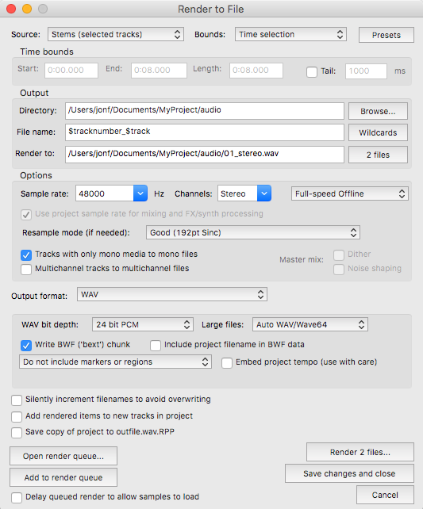

# Preparing audio assets

The starting point for building an experience using *Audio Orchestrator* is a set of audio files. You can create these however you like, but there are strict requirements for their format and naming.

These [requirements](#requirements) are outlined below. There is also a [guide for exporting files](#REAPER) that satisfy the requirements from the REAPER digital audio workstation (DAW).

## Audio file requirements

* There must be **one continuous mono or stereo `.wav` file** for each object.

!!! Tip
    * Audio files must be waveform audio but there are no restrictions on sample rate or bit depth.

    * *Audio Orchestrator* does not handle files with more than two channels; you can only use mono or stereo files.

* All files must be exactly the **same length**.
* Filenames must **start with ascending numbers**. For example, `01_example.wav`, `02_second.wav`, `03_more.wav`, and so on.

!!! Tip
    * Audio files will be imported in ascending order according to these numbers.
    * Once in *Audio Orchestrator*, the files can't be re-ordered, so to change file order it is necessary to rename your files then re-import them. Note that you'll have to re-add any [behaviours](audio.md#behaviours), so wherever possible it's best to know the order of objects before starting.
    * The order of files determines the order in which they're processed by the [allocation algorithm](allocation-algorithm.md). For some of the custom behaviours, this ordering is important. For example:
        * an [exclusive object](custom-behaviours.md#exclusive) that is processed early on might stop other objects from being allocated;
        * an [exclusive object](custom-behaviours.md#exclusive) that is processed later might be less likely to find a suitable device; or
        * if two objects have [images or effects](image-behaviour.md) attached, then the image associated with the earliest-processed object will be shown.

## Panning

Panning for mono files can be authored inside *Audio Orchestrator*, but is automatically added for audio files with certain suffixes.

* Files ending in `_L.wav` will be panned 100% left.
* Files ending in `_R.wav` will be panned 100% right.
* Files ending in `_C.wav` will be panned centrally.

Note that the panning can be overwritten in *Audio Orchestrator* (but cannot be changed for stereo files).

## How to export suitable files from REAPER

The following process can be followed to export files in a suitable format from the REAPER DAW.

* Select the time region that you'd like to export by left-clicking and dragging in the timeline ruler.

!!! Tip
    You can select a time region that's the length of a clip by holding shift and double-clicking the clip.

* Select all the tracks that you'd like to export.

!!! Tip
    * Click any space in the track control panel to select that track.
    * To select multiple adjacent tracks, click the first track then shift-click another to select all tracks between them.
    * To select multiple non-adjacent tracks, command-click the desired tracks.

* Open the *Render to File* dialogue by going to `File > Render...` or pressing `command+shift+R`.

* Set up options in the *Render to File* dialogue.

    * Set the *Source* to *Stems (selected tracks)* and the *Bounds* to *Time selection*.

    * Select the directory where you'd like to save the exported files.

    * Add a numerical prefix to the exported filenames by clicking *Wildcards* and selecting the *$tracknumber* option.

    * Choose your desired *Sample rate* and set *Channels* to *Stereo*.

    * Tick the box next to *Tracks with only mono media to mono files*.

    * Make sure the *Output format* is set to *WAV*.

* Click *Render [n] files...* to export your audio.

{: .ao-image-centre}
*Suggested REAPER rendering settings*

!!! Tip

    You may want to convert some stereo or multichannel items to mono items. To do this in REAPER, follow the steps below.

    * Right click the stereo item you'd like to convert, then select `Item processing > Explode multichannel audio or MIDI items to new one-channel items`.

    * This will create new mono tracks for each channel of your multichannel track. But the multichannel track will still exist as the parent of your mono tracks. Click the small folder icon underneath the track number. This will remove the new mono tracks from the parent folder so that you can delete the original multichannel track.

    * You can now delete the original track. Select the track, press the backspace key, then click "Yes" to confirm the deletion. Or, right click and select `Remove track`.
