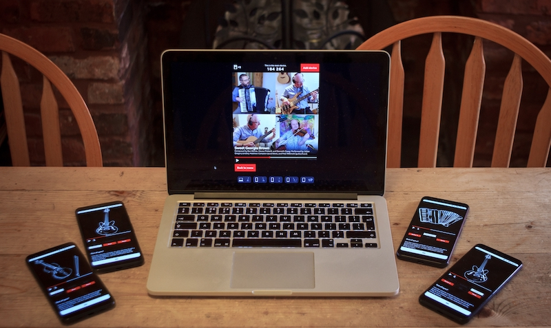
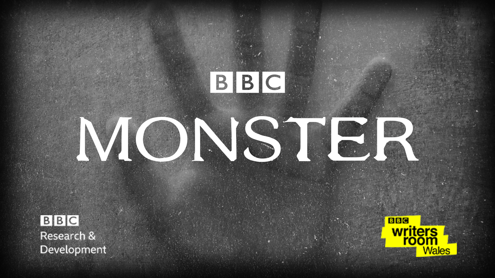
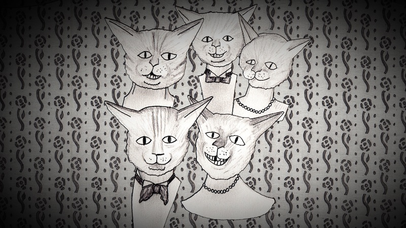
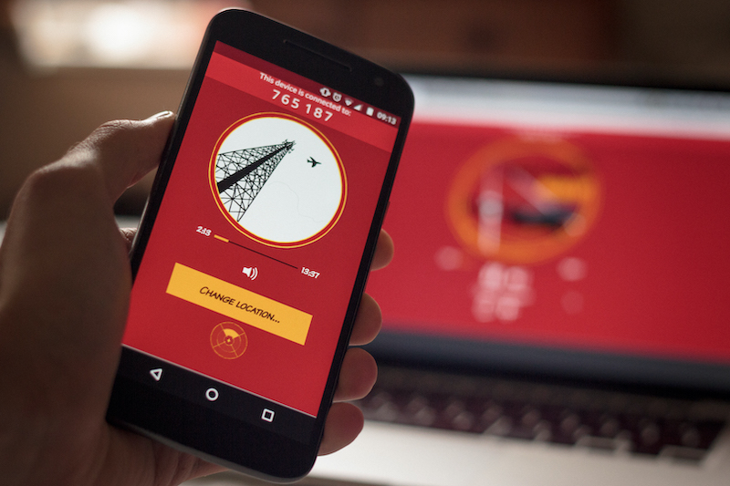

# Orchestrated audio productions

Audio device orchestration can be used to create interactive and immersive audio experiences for multiple connected devices. This page lists a few examples made with BBC R&D's tools.

## Pilot productions

We've released a number of pilot productions on [BBC Taster](https://www.bbc.co.uk/taster){: target=_blank }. Most of the following pilots are no longer available to listen to, but you can still follow the links to find out more.

### Seeking New Gods (2021)

** [Find out more](https://www.bbc.co.uk/rd/blog/2021-05-gruff-rhys-seeking-new-sounds-surround){: target=_blank }

*Seeking New Gods* is an album by musician Gruff Rhys. Gruff and the production team used *Audio Orchestrator* to create an immersive multi-device version of the album. The mix was designed for four or more devices (although the experience works with two or more). There's also a bonus track that can only be unlocked with five or more devices. [Calibration mode](prototype.md#calibration-mode) can be used to ensure that devices are accurately synchronised.

### Spectrum Sounds (2021)

** [Find out more](https://www.bbc.co.uk/rd/blog/2021-09-hearing-synaesthesia-audio-composition-music){: target=_blank }

*Spectrum Sounds* is a collection of seven short pieces of music (for different colours of the spectrum) by composer Andrew Hugill. The orchestrated version allows listeners to set up and control their own listening situation by disseminating sounds (and images) across three or more connected devices. You can choose to listen with or without spoken commentary by the composer, and a written transcript is also available to view in the application.

{: target=_blank }

### Pick A Part (2020)

** [Find out more](https://www.bbc.co.uk/rd/blog/2020-09-proms-synchronised-audio-music-interactive){: target=_blank }

*Pick A Part* was created by BBC R&D and the [BBC Philharmonic](https://www.bbc.co.uk/philharmonic){: target=_blank }. It's a music experience; when you connect extra devices you can choose which instruments they play. It makes use of [calibration mode](prototype.md#calibration-mode) in the prototype application to make sure that the instruments are playing in time with each other.

{: target=_blank }

### Monster (2020)

** [Find out more](https://www.bbc.co.uk/rd/blog/2020-08-audio-drama-monster-interactive-sound){: target=_blank }

*Monster* is a collaboration between BBC R&D and [BBC Writersroom Wales](https://www.bbc.co.uk/writersroom/){: target=_blank }. It's an immersive horror-themed audio drama telling the story of what happens when the dead return looking for answers and someone to blame. *Monster* lasts approximately 30 minutes and is designed to require at least three connected devices. As well as audio, the devices play timed images and lighting effects.

{: target=_blank }

### 1927's Decameron Nights (2020)

** [Find out more](https://www.bbc.co.uk/rd/blog/2020-08-audio-drama-surround-sound-spatial){: target=_blank }

*Decameron Nights* was created by [1927](https://www.19-27.co.uk/decameron-nights){: target=_blank } for BBC Arts and [BBC Radio 3](https://www.bbc.co.uk/programmes/m000lndx){: target=_blank }—it started life as a stereo radio production but was reimagined for orchestrated devices. Episode 1, *I'm Alright Jack*, is a trio of folk tales about "looking out for number one".

{: target=_blank }

### The Vostok-K Incident (2018)

** [Find out more](https://www.bbc.co.uk/rd/blog/2018-10-multi-speaker-immersive-audio-metadata){: target=_blank }

*The Vostok-K Incident* is a short science fiction audio drama produced by [Naked Productions](http://nakedproductions.co.uk/){: target=_blank } as part of the [S3A Project](https://www.s3a-spatialaudio.org/){: target=_blank }. It was our first experimental orchestrated audio production, made before we built *Audio Orchestrator* but using the same underlying framework.

{: target=_blank }
