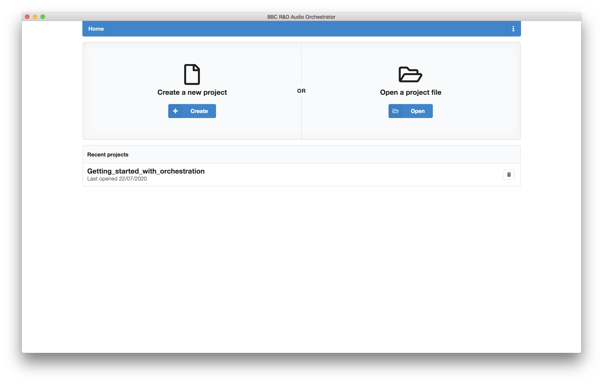
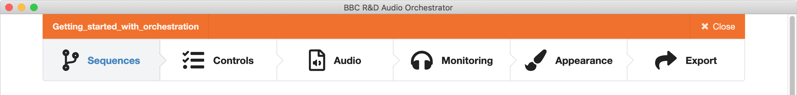
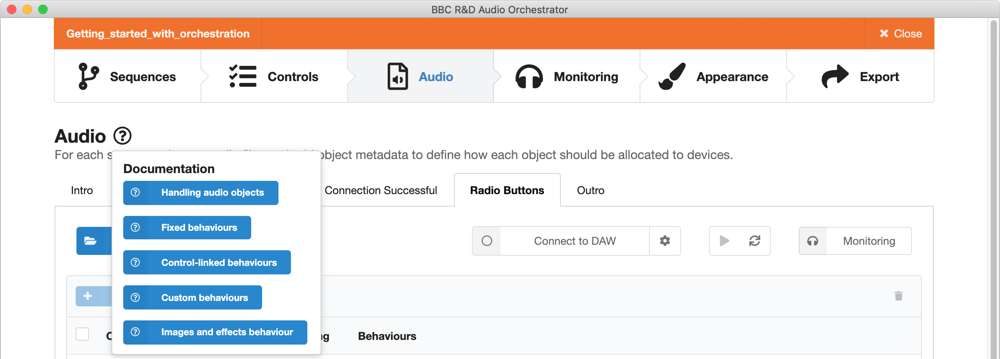
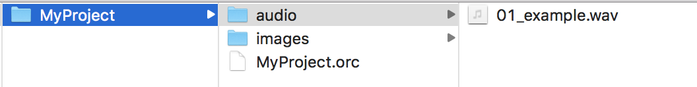

# Creating and loading projects

The first stage in making your orchestrated audio experience is to create or load a project file. This can be done from the Home page of *Audio Orchestrator*.

*The Audio Orchestrator Home page*

## Creating a new project

To create a new project, click the "Create" button. A file dialogue will appear—use this to select the location and filename for your project. *Audio Orchestrator* projects use the `.orc` file extension. Clicking "Save" will create your project file and open the new project on the [Sequences](sequences.md) page.

!!! Tip
    Audio and image assets used in your project are not stored in the project file. It's a good idea to move or copy all of these assets to the same directory as the project file before you import them into *Audio Orchestrator*. See below for the [suggested project folder structure](#moving-projects).

## Opening an existing project

To open an existing project, click "Open" and use the file dialogue to find your project.

Alternatively, you can click on a project row in the recent projects list. The projects you've worked on most recently will appear at the top of the list. Note that clicking the delete button just removes a project from the recent projects list—it doesn't delete the project file.    

## Working with an Audio Orchestrator project

When you create a new project or load an existing project, you'll land on the [Sequences page](sequences.md). At the top of every *Audio Orchestrator* page, you'll see a menu bar that you can use to move between the different pages ([Sequences](sequences.md), [Controls](controls.md), [Audio](audio.md), [Monitoring](monitoring.md), [Appearance](appearance.md), and [Export](export.md)). The project filename is shown in the top left corner.

*Audio Orchestrator page menu bar*

To leave a project and return to the Home page, you can click "Close" in the top right corner. Note that any changes you make to a project are automatically saved, so you won't lose anything by clicking "Close".

### Getting help

If there's something in *Audio Orchestrator* that you don't understand, clicking the question mark icon next to the page title will give you links to relevant pages in the documentation.

*Audio Orchestrator inline documentation links*

### Saving changes to a project

Any changes you make to your project are automatically saved, so you don't need to do anything. You might see a *Saving... Saved* message in the top left corner after you make a change.

### Backing up and moving projects between machines

*Audio Orchestrator* project files (`.orc` files) do not include the audio or image assets used in the project. To backup and/or move projects between machines, you'll need to make sure that you copy all of the audio files and images as well as the project file.

If your audio and image files are stored in the same directory as the project file, or in a subdirectory of that file, then *Audio Orchestrator* will automatically be able to find them and add them to the project even if you move the project folder on your computer or to a different computer. Consequently, we recommend structuring your project folder as shown in the image below.

*Suggested project folder structure*

If you move a project file on the same computer, *Audio Orchestrator* should still be able to locate the audio and image assets. But if you move that project file to a different computer, you'll need to re-add these files (see the documentation for the [Audio](audio.md#adding-files) and [Appearance](appearance.md) pages).

!!! Note
    *Audio Orchestrator* (`.orc`) project files contain JavaScript Object Notation (JSON) data, so they can be read and edited in a text editor (although this is not recommended unless you're confident you know what you're doing and you've backed up your project file).
