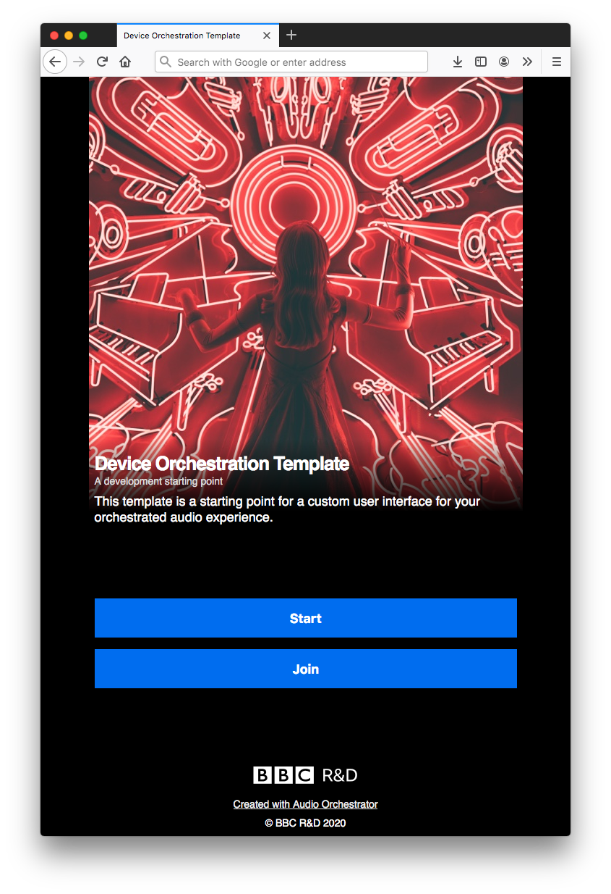
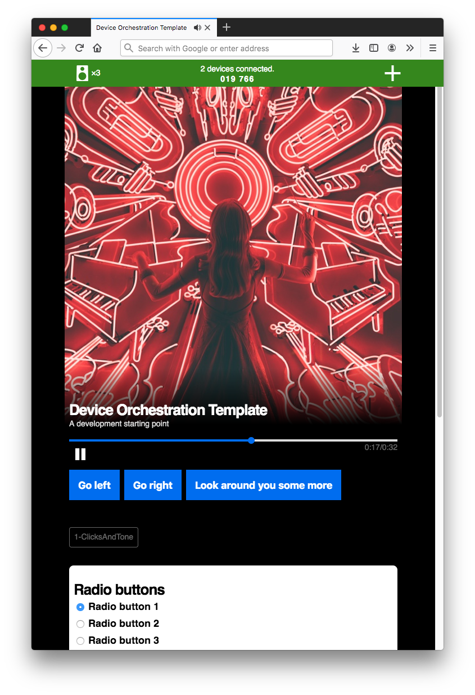
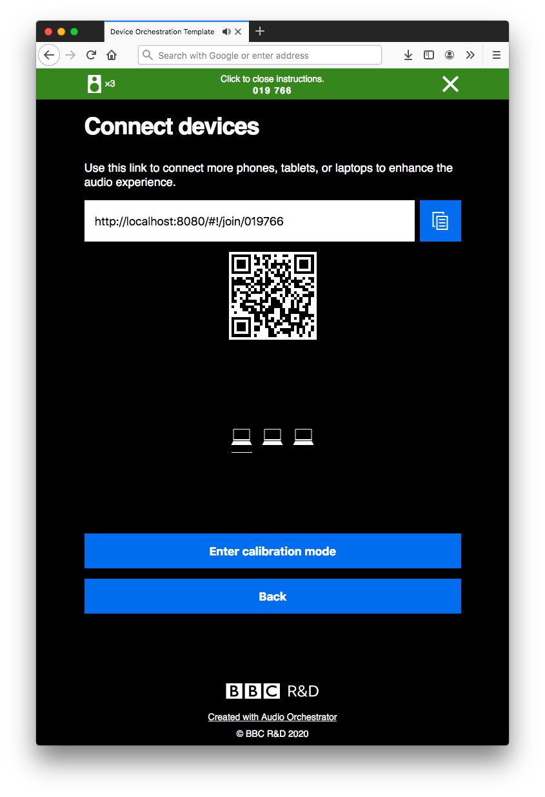
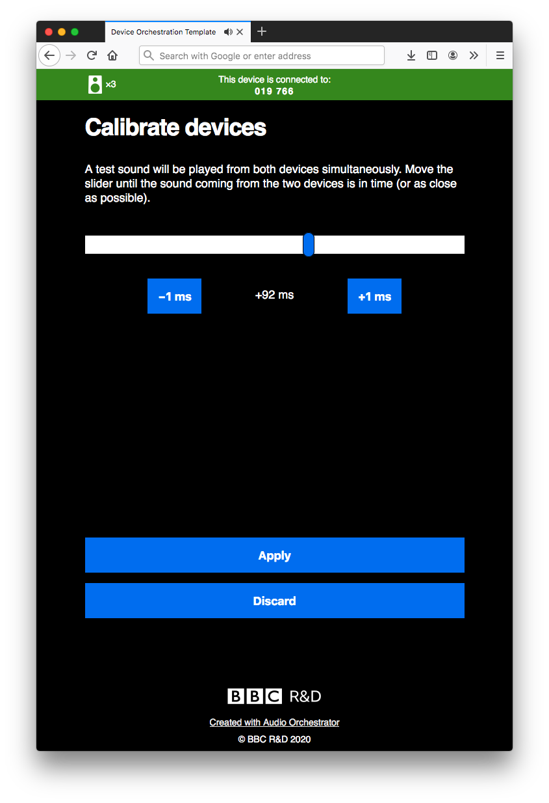

# The prototype application

The output from using *Audio Orchestrator* is a prototype web application for the orchestrated audio experience that you've built. This is a combination of HTML pages and JavaScript code that includes all of the necessary components for audio orchestration, wrapped with a user interface.

From the [Export page](export.md), the application can either be [previewed](export.md#export-preview) or [exported](export.md#export-export). If you preview the application, all you need to do is point your browser at the right URL (which will be shown in *Audio Orchestrator*)—but you'll have to have *Audio Orchestrator* running and can only connect devices on the same network. If you export, you'll need to host the application somewhere. There are more details in the [Export page](export.md) documentation.

An orchestrated experience is hosted on the *main device*. A session is defined by a six-digit *pairing code*, which can be used to connect one or more *aux devices*.

Check out the [example project](example.md) to see the prototype application in action.

## Using the prototype application

The application home page shows a short introductory paragraph and buttons with two options.

* **Start new session**. The device that starts a session will be the main device.

* **Join existing session**.  If there's already an existing session, clicking this button will give you the chance to enter the pairing code and join as an aux device.

{: .ao-image-tall}
*Prototype application home page*

Once you've started a session, you'll see some or all of the following components (listed from top to bottom of the page). The appearance and functionality will depend on the experience and also differ on main and aux devices.

* **Status bar**. The status bar displays the pairing code and the number of aux devices connected. Clicking the status bar opens the [connection instructions](#connection-instructions), which include various ways to connect aux devices to the session as well as a button for entering [calibration mode](#calibration-mode) (see below for more detail). A second click on the status bar, or clicking the "Back" button, closes these instructions.

* **Cover image**. A square image. By default, this will be the same on all devices. But an [*Images and effects* behaviour](image-behaviour.md) can be used to vary the image during an experience.

* **Title and subtitle**. These are the same on all pages of the application and on all devices.

* **Playback controls**. A progress bar indicating the time elapsed in the currently playing sequence, and a play/pause button. Choose whether the play/pause button will be enabled on aux devices on the [Appearance page](appearance.md) of *Audio Orchestrator*.

* **Sequence destinations**. If the experience has more than one sequence, buttons enabling the listener to move between sequences may be shown. These depend on settings made on the [Sequences page](sequences.md). Note that destinations will only be shown on the main device.

* **Object labels**. The application may display the filenames of the audio objects that are currently allocated to that device. This is primarily intended for testing purposes. These labels can be turned on or off on the [Appearance page](appearance.md) of *Audio Orchestrator*.

* **Controls**. If the sequence has any controls, they will be shown at the bottom of the page. This will depend on settings made on the [Controls page](controls.md). Controls may be shown on just the main device, just the aux devices, or any devices. The listener can make choices that can affect the audio objects allocated to that device.

{: .ao-image-tall}
*Prototype application playing page*

### Connection instructions

The instructions page contains details of the various ways to connect aux devices to a session.

  * Share the link (manually by copying the link or clicking the *copy* icon). On some mobile devices, the *share* button can be used to share the link using the operating system's built-in sharing function.
  * Scan the QR code.
  * Share the pairing code to be manually entered after clicking "Join existing session" on the application home page.

The connection instructions page also shows an icon for each of the devices that are connected to the session, and has a button for accessing [*calibration mode*](#calibration-mode) (if it was [enabled](appearance.md#interface-options) in *Audio Orchestrator*).

{: .ao-image-tall}
*Connection instructions page*

Connection instructions can also be shown on the main playing page by enabling the option in the [sequence settings](sequences.md#sequence-settings).

### Calibration mode

The orchestrated audio system underlying the prototype application uses a cloud-based synchronisation server to keep devices in sync, but this can't account for delay introduced by the software and hardware on individual devices. On some devices, this can be negligible, but on others, it's large enough (~200 ms) to make orchestration unsuitable for some types of sound that require very accurate synchronisation (such as rhythmic music).

To help mitigate this, the prototype application can include a calibration stage, where listeners can manually adjust a time delay on an aux device to align it more accurately with the main device.

Calibration mode can be started by clicking "Enter calibration mode" on the [instructions page](#connection-instructions). Each aux devices will also show a prompt for the listener to calibrate the device, and a calibration mode button (metronome icon) with the playback controls.

When calibration mode is started, the main device will show a short instruction message and a button labelled "Exit calibration". The aux devices will show a button labelled "Calibrate this device", as well as an "Exit calibration" button.

Clicking "Calibrate this device" brings up a slider on the aux device. The main device and selected aux device will play the same audio, and moving the slider changes the time offset between the devices. You can also make fine-grained adjustments using the plus and minus buttons.

!!! Tip
    If the aux device is lagging behind the main device, a positive offset will align the devices.

Once you're happy that the devices are as closely synchronised as possible, click "Apply" to save the value. You'll then be able to "Clear calibration" (to reset the offset to 0 ms), "Calibrate this device" (to recalibrate), or "Exit calibration" to return to the experience.

{: .ao-image-tall}
*Calibration mode on an aux device*

## Customising the user interface

Many of the components descried above can be customised from *Audio Orchestrator*. See the documentation on the [Appearance page](appearance.md) to find out how you can make small changes to the look and feel of the prototype application.

!!! Info
    The extent to which the prototype application can be customised from *Audio Orchestrator* is limited.

    There are some [extra features and customisations](customise-prototype.md) that can be used with the exported prototype application by making changes in the code. Having some familiarity with coding (particularly JavaScript) will be helpful but not essential—[see the Advanced section of this documentation](customise-prototype.md) for more details.
