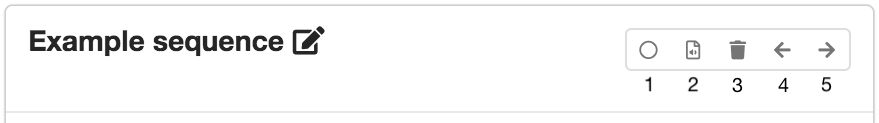
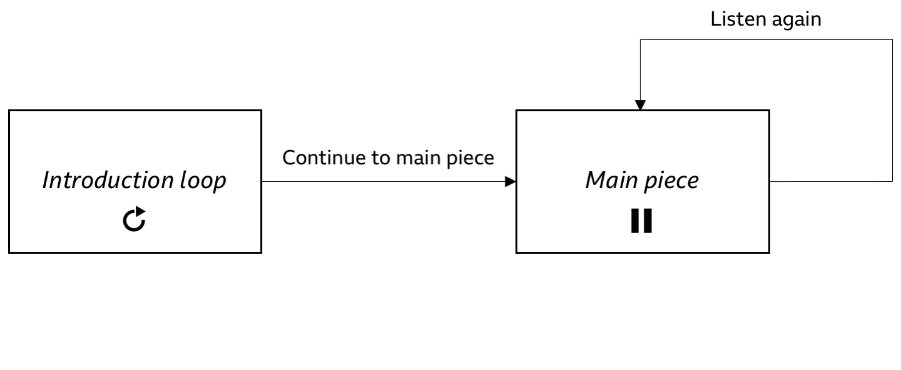
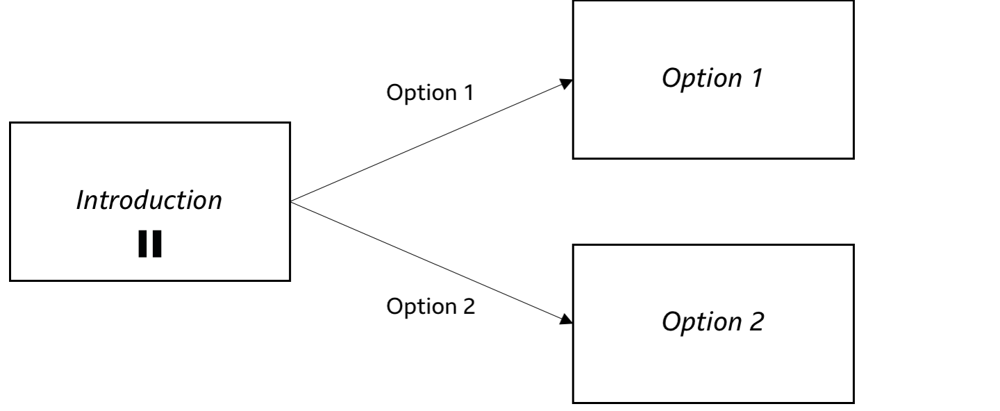

# Sequences page

A sequence is an independent section of content. Orchestrated experiences can be made up of one or more sequences, which are defined on the Sequences page.

The first sequence that the listener will see when the experience starts is called the *entry point*. From here, the listener may be able to choose [*destination*](#sequence-destinations) sequences—or you can control the flow through the experience as the producer.

The sections below show you how to set up and configure any sequences that you need for your experience.

## Setting up a sequence

A new project starts with one sequence by default. If you need, you can add more sequences by clicking "Add sequence".

Click on the sequence name to change it. The sequence name will not be seen by the listener, but is used when setting up [sequence destinations](#sequence-destinations).

There is a group of buttons in the top right corner of each sequence card (labelled one to five in the screenshot below).

*Option buttons on a sequence card*

1. **Select the entry point** (select this on the first sequence you want the listener to see when the experience starts).
2. Go to the **[Audio page](audio.md)** for that sequence.
3. **Delete a sequence** (not available for the entry point sequence).
4. **Move the sequence card** one place to the left.
5. **Move the sequence card** one place to the right.

!!! Tip
    Moving a sequence card to the left or right just changes the display that you'll see in *Audio Orchestrator*—not the order in which the sequences are presented to the listener. The order of sequences in the experience will start with the entry point sequence, then be defined by sequence destinations that you set up.

## Sequence destinations

Destinations are sequences that can be reached from the current sequence. They may be shown to the listener as buttons (depending on the [sequence settings](#sequence-settings)).

Click on the arrow to expand the sequence destinations section. Click "Add destination" to add a new destination. It will appear as a row in the destinations table, where you can choose the destination sequence and add a button label. To delete a destination, click the delete button.

!!! Tip
    * You can set up as many destinations as you need.
    * A sequence can have itself as a destination—for example, to create a "Listen again" button.
    * The sequence destinations section heading indicates the number of destinations that have been set up in brackets.

If the sequence settings are such that the sequence will not loop or wait for the user to choose a destination, the experience will automatically move to the first sequence destination (i.e. the destination at the top of the list).

## Sequence settings

Settings determine how the sequence is displayed and when playback will move to the next sequence.

Click on the arrow to expand the sequence settings section. You will see four options.

* **Loop this sequence**. If this box is checked, the sequence will immediately loop back to the beginning when it reaches the end of the content. The only way to move to another sequence is for the user to select a destination. If it is unchecked, then the sequence will either move directly to the first destination, or hold and wait for user input, depending on the "Wait for user..." setting (see below).

!!! Tip
    If "Loop..." is selected, the other two settings are not available. The destination buttons must be visible, otherwise the listener would have no way to move between sequences. And the sequence will not wait for listener input at the end, because it will loop back to the start.

* **Destination buttons always visible**. If this box is checked, the buttons that allow the listener to choose a destination will be visible throughout the sequence. If it is unchecked, then those buttons will only appear at the end of the sequence.

* **Wait for user to choose a destination at end of sequence**. If this box is checked, the experience will not progress to the next sequence until the listener makes a selection. If it is unchecked, the experience will immediately proceed to the first destination (i.e. the top row of the destinations table) when the sequence ends.

* **Show connection instructions during this sequence**. If this box is checked, the [connection instructions](prototype.md#connection-instructions) will overlay the image on the playing page. This can be used to make it easier for the listener to connect extra devices without having to open the connection instructions by clicking the [status bar](prototype.md#prototype-features).

## Examples

!!! Example "Example 1"
    **Introduction loop and main piece**

    A project has two sequences: the *Introduction loop* and the *Main piece*.

    * The *Introduction loop* is the entry point. It has one destination—the *Main piece*—and is set to loop until the listener clicks "Continue to main piece".

    * The *Main piece* has one destination—itself—with the label "Listen again". It does not loop and the destination button is not visible until the end of the sequence is reached. But, it does wait for input at the end of the sequence, so that it doesn't just immediately start playing again.

    
    *Example 1: introduction loop and main piece*

!!! Example "Example 2"
    **Simple branching narrative**

    Sequences can be used to set up simple "choose your own adventure"-style branching narratives. A simple example might include three sequences: *Introduction*, *Option 1*, and *Option 2*.

    * The *Introduction* sequence contains audio that sets up a choice for the user. At the end of the sequence, the destinations are shown to the user, who can choose one of the two options.

    * The *Option 1* and *Option 2* sequences are alternative endings, so they don't need any destinations. Note that sequences without destinations will show a warning on the "Export" page. If this was a deliberate choice, then that warning can be safely ignored.   

    
    *Example 2: simple branching narrative*
